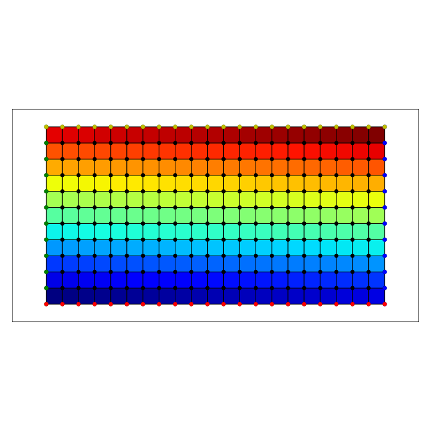
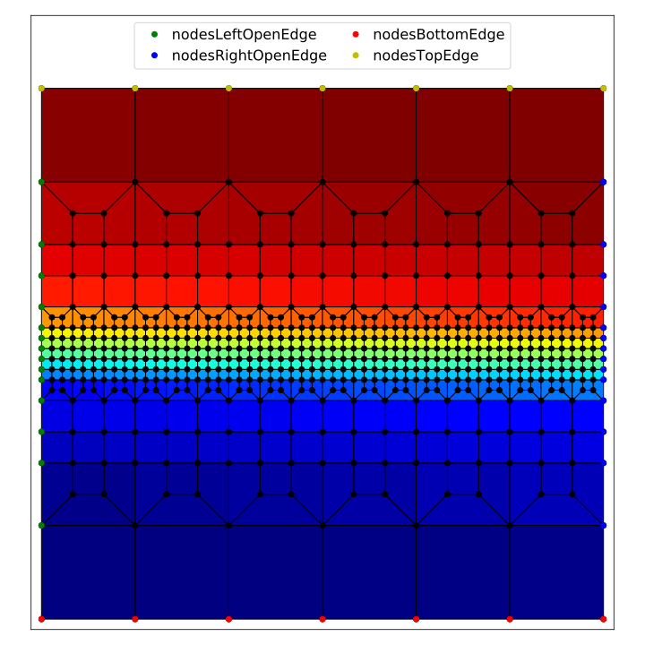

**************
GooseFEM::Mesh
**************

Generic methods
===============

[:download:`GooseFEM/Mesh.h <../src/GooseFEM/Mesh.h>`, :download:`GooseFEM/Mesh.hpp <../src/GooseFEM/Mesh.hpp>`]

GooseFEM::Mesh::dofs
--------------------

.. code-block:: cpp

  GooseFEM::MatS GooseFEM::Mesh::dofs(size_t nnode, size_t ndim)

Get a sequential list of DOF-numbers for each vector-component of each node. For example for 3 nodes in 2 dimensions the output is

.. math::

  \begin{bmatrix}
    0 & 1 \\
    2 & 3 \\
    4 & 5
  \end{bmatrix}

GooseFEM::Mesh::renumber
------------------------

.. code-block:: cpp

  GooseFEM::MatS GooseFEM::Mesh::renumber(const GooseFEM::MatS &dofs)

Renumber (DOF) indices to lowest possible indices. For example:

.. math::

  \begin{bmatrix}
    0 & 1 \\
    5 & 4
  \end{bmatrix}

is renumbered to

.. math::

  \begin{bmatrix}
    0 & 1 \\
    3 & 2
  \end{bmatrix}

Or, in pseudo-code, the result of this function is that:

.. code-block:: python

  dofs = renumber(dofs)

  sort(unique(dofs[:])) == range(max(dofs+1))

.. tip::

  A generic interface using iterator is available if you do not which to use the default Eigen interface.

GooseFEM::Mesh::reorder
-----------------------

.. code-block:: cpp

  GooseFEM::MatS GooseFEM::Mesh::reorder(const GooseFEM::MatS &dofs, const ColS &idx, std::string location="end")

Reorder (DOF) indices such to the lowest possible indices, such that some items are at the beginning or the end. For example:

.. math::

  \mathrm{dofs} =
  \begin{bmatrix}
    0 & 1 \\
    2 & 3 \\
    4 & 5
  \end{bmatrix}

with

.. math::

  \mathrm{idx} =
  \begin{bmatrix}
    0 & 1
  \end{bmatrix}

Implies that ``dofs`` is renumbered such that 0 becomes the one-before-last index (:math:`0 \rightarrow 4`), and the 1 becomes the last index (:math:`1 \rightarrow 5`). The remaining items are renumbered to the lowest index while keeping the same order. The result:

.. math::

  \begin{bmatrix}
    4 & 5 \\
    0 & 1 \\
    2 & 3
  \end{bmatrix}

.. tip::

  A generic interface using iterator is available if you do not which to use the default Eigen interface.

GooseFEM::Mesh::elem2node
-------------------------

.. code-block:: cpp

  GooseFEM::SpMatS GooseFEM::Mesh::elem2node(const GooseFEM::MatS &conn)

Return a sparse matrix which contains the element numbers (columns) that are connected to each node (rows).

.. warning::

  One should not confuse the element ``0`` when this matrix is converted to a dense matrix. When this is done all the 'missing' items are filled in as zero, which does have a meaning here.

Predefined meshes
=================

GooseFEM::Mesh::Tri3
--------------------

[:download:`GooseFEM/MeshTri3.h <../src/GooseFEM/MeshTri3.h>`, :download:`GooseFEM/MeshTri3.hpp <../src/GooseFEM/MeshTri3.hpp>`]

GooseFEM::Mesh::Tri3::Regular
^^^^^^^^^^^^^^^^^^^^^^^^^^^^^

No description yet, please consult the code.

GooseFEM::Mesh::Quad4
---------------------

[:download:`GooseFEM/MeshQuad4.h <../src/GooseFEM/MeshQuad4.h>`, :download:`GooseFEM/MeshQuad4.hpp <../src/GooseFEM/MeshQuad4.hpp>`]

Naming convention
^^^^^^^^^^^^^^^^^

.. image:: figures/MeshQuad4/naming_convention.svg
  :width: 350px
  :align: center

GooseFEM::Mesh::Quad4::Regular
^^^^^^^^^^^^^^^^^^^^^^^^^^^^^^

.. code-block:: cpp

  GooseFEM::Mesh::Quad4::Regular(size_t nelx, size_t nely, double h=1.);

Regular mesh of linear quadrilaterals in two-dimensions. The element edges are all of the same size :math:`h` (by default equal to one), optional scaling can be applied afterwards. For example the mesh shown below that consists of 21 x 11 elements. In that image the element numbers are indicated with a color, and likewise for the boundary nodes.

Methods:

.. code-block:: cpp

  // A matrix with on each row a nodal coordinate:
  // [ x , y ]
  MatD = GooseFEM::Mesh::Quad4::Regular.coor();

  // A matrix with the connectivity, with on each row to the nodes of each element
  MatS = GooseFEM::Mesh::Quad4::Regular.conn();

  // A list of boundary nodes
  ColS = GooseFEM::Mesh::Quad4::Regular.nodesBottom();
  ColS = GooseFEM::Mesh::Quad4::Regular.nodesTop();
  ColS = GooseFEM::Mesh::Quad4::Regular.nodesLeft();
  ColS = GooseFEM::Mesh::Quad4::Regular.nodesRight();

  // A matrix with periodic node pairs on each row:
  // [ independent nodes, dependent nodes ]
  MatS = GooseFEM::Mesh::Quad4::Regular.nodesPeriodic();

  // The node at the origin
  size_t = GooseFEM::Mesh::Quad4::Regular.nodeOrigin();

  // A matrix with DOF-numbers: two per node in sequential order
  MatS = GooseFEM::Mesh::Quad4::Regular.dofs();

  // A matrix with DOF-numbers: two per node in sequential order
  // All the periodic repetitions are eliminated from the system
  MatS = GooseFEM::Mesh::Quad4::Regular.dofsPeriodic();

GooseFEM::Mesh::Quad4::FineLayer
^^^^^^^^^^^^^^^^^^^^^^^^^^^^^^^^

Regular mesh with a fine layer of quadrilateral elements, and coarser elements above and below.

.. note::

  The coarsening depends strongly on the desired number of elements in horizontal elements. The becomes clear from the following example:

  .. code-block:: cpp

    mesh = GooseFEM::Mesh::Quad4::FineLayer(6*9  ,51); // left   image :  546 elements
    mesh = GooseFEM::Mesh::Quad4::FineLayer(6*9+3,51); // middle image :  703 elements
    mesh = GooseFEM::Mesh::Quad4::FineLayer(6*9+1,51); // right  image : 2915 elements

  .. image:: figures/MeshQuad4/FineLayer/behavior.svg
    :width: 1000px
    :align: center

Methods:

.. code-block:: cpp

  // A matrix with on each row a nodal coordinate:
  // [ x , y ]
  MatD = GooseFEM::Mesh::Quad4::Regular.coor();

  // A matrix with the connectivity, with on each row to the nodes of each element
  MatS = GooseFEM::Mesh::Quad4::Regular.conn();

  // A list of boundary nodes
  ColS = GooseFEM::Mesh::Quad4::Regular.nodesBottom();
  ColS = GooseFEM::Mesh::Quad4::Regular.nodesTop();
  ColS = GooseFEM::Mesh::Quad4::Regular.nodesLeft();
  ColS = GooseFEM::Mesh::Quad4::Regular.nodesRight();

  // A matrix with periodic node pairs on each row:
  // [ independent nodes, dependent nodes ]
  MatS = GooseFEM::Mesh::Quad4::Regular.nodesPeriodic();

  // The node at the origin
  size_t = GooseFEM::Mesh::Quad4::Regular.nodeOrigin();

  // A matrix with DOF-numbers: two per node in sequential order
  MatS = GooseFEM::Mesh::Quad4::Regular.dofs();

  // A matrix with DOF-numbers: two per node in sequential order
  // All the periodic repetitions are eliminated from the system
  MatS = GooseFEM::Mesh::Quad4::Regular.dofsPeriodic();

  // A list with the element numbers of the fine elements in the center of the mesh
  // (highlighted in the plot below)
  ColS = GooseFEM::Mesh::Quad4::FineLayer.elementsFine();

    .. image:: figures/MeshQuad4/FineLayer/example_elementsFine.svg
      :width: 500px
      :align: center

GooseFEM::Mesh::Hex8
--------------------

[:download:`MeshHex8.h <../src/GooseFEM/MeshHex8.h>`, :download:`MeshHex8.hpp <../src/GooseFEM/MeshHex8.hpp>`]

Naming convention
^^^^^^^^^^^^^^^^^

The following naming convention is used:

* **Front**: all nodes whose coordinates :math:`0 \leq x \leq L_x`, :math:`0 \leq y \leq L_y`, :math:`z = 0`.
* **Back**: all nodes whose coordinates :math:`0 \leq x \leq L_x`, :math:`0 \leq y \leq L_y`, :math:`z = L_z`.
* **Bottom**: all nodes whose coordinates :math:`0 \leq x \leq L_x`, :math:`0 \leq z \leq L_z`, :math:`y = 0`.
* **Top**: all nodes whose coordinates :math:`0 \leq x \leq L_x`, :math:`0 \leq z \leq L_z`, :math:`y = L_y`.
* **Left**: all nodes whose coordinates :math:`0 \leq y \leq L_y`, :math:`0 \leq z \leq L_z`, :math:`x = 0`.
* **Right**: all nodes whose coordinates :math:`0 \leq y \leq L_y`, :math:`0 \leq z \leq L_z`, :math:`x = L_x`.

The edges and corners follow from the intersections, i.e.

* **FrontBottomEdge**: all nodes whose coordinates :math:`0 \leq x \leq L_x`, :math:`y = 0`, :math:`z = 0`.
* ...
* **FrontBottomLeftCorner**: the node whose coordinate :math:`x = 0`, :math:`y = 0`, :math:`z = 0`.
* ...

.. image:: figures/MeshHex8/naming_convention.svg
  :width: 350px
  :align: center

GooseFEM::Mesh::Hex8::Regular
^^^^^^^^^^^^^^^^^^^^^^^^^^^^^

Regular mesh.

GooseFEM::Mesh::Hex8::FineLayer
^^^^^^^^^^^^^^^^^^^^^^^^^^^^^^^

Mesh with a middle plane that is fine the middle, and becomes course away from this plane.

Type specific methods
=====================

GooseFEM::Mesh::Tri3
--------------------

GooseFEM::Mesh::Tri3::Regular
^^^^^^^^^^^^^^^^^^^^^^^^^^^^^

[:download:`GooseFEM/MeshTri3.h <../src/GooseFEM/MeshTri3.h>`, :download:`GooseFEM/MeshTri3.hpp <../src/GooseFEM/MeshTri3.hpp>`]

GooseFEM::Mesh::Tri3::getOrientation
^^^^^^^^^^^^^^^^^^^^^^^^^^^^^^^^^^^^

No description yet, please consult the code.

GooseFEM::Mesh::Tri3::setOrientation
^^^^^^^^^^^^^^^^^^^^^^^^^^^^^^^^^^^^

No description yet, please consult the code.

GooseFEM::Mesh::Tri3::retriangulate
^^^^^^^^^^^^^^^^^^^^^^^^^^^^^^^^^^^^

No description yet, please consult the code.

GooseFEM::Mesh::Tri3::TriUpdate
^^^^^^^^^^^^^^^^^^^^^^^^^^^^^^^

No description yet, please consult the code.

GooseFEM::Mesh::Tri3::Edge
^^^^^^^^^^^^^^^^^^^^^^^^^^

No description yet, please consult the code.
