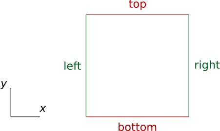

***********
Mesh::Quad4
***********

| :download:`GooseFEM/MeshQuad4.h <../../include/GooseFEM/MeshQuad4.h>`
| :download:`GooseFEM/MeshQuad4.hpp <../../include/GooseFEM/MeshQuad4.hpp>`

Naming convention
=================

.. todo::

  Finish

Mesh::Quad4::Regular
====================

Regular mesh.

.. todo::

  Describe, illustrate

.. todo::

  figures/MeshQuad4/Regular/example...

.. todo::

  figures/MeshQuad4/Regular/example2...

.. todo::

  figures/MeshQuad4/Regular/nodes...

Mesh::Quad4::FineLayer
======================

Mesh with a middle plane that is fine the middle, and becomes course away from this plane.

.. todo::

  Describe, illustrate

.. todo::

  figures/MeshQuad4/FineLayer/behaviour...

.. todo::

  figures/MeshQuad4/FineLayer/element-numbers...

.. todo::

  figures/MeshQuad4/FineLayer/example...

.. todo::

  figures/MeshQuad4/FineLayer/example2...

.. todo::

  figures/MeshQuad4/FineLayer/nodes...

Mesh::Quad4::Map::RefineRegular
===============================

Refine mesh.

.. todo::

  Describe, illustrate

Mesh::Quad4::Map::FineLayer2Regular
===================================

Map "Regular" mesh to "FineLayer" mesh.

.. todo::

  Describe, illustrate

.. todo::

  figures/MeshQuad4/FineLayer2Regular/element-numbers...

.. todo::

  figures/MeshQuad4/FineLayer2Regular/map...
