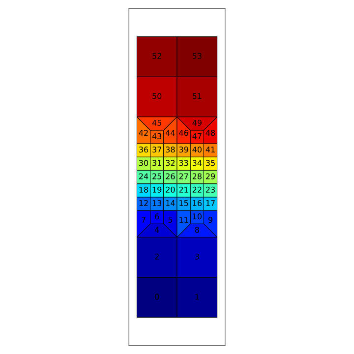
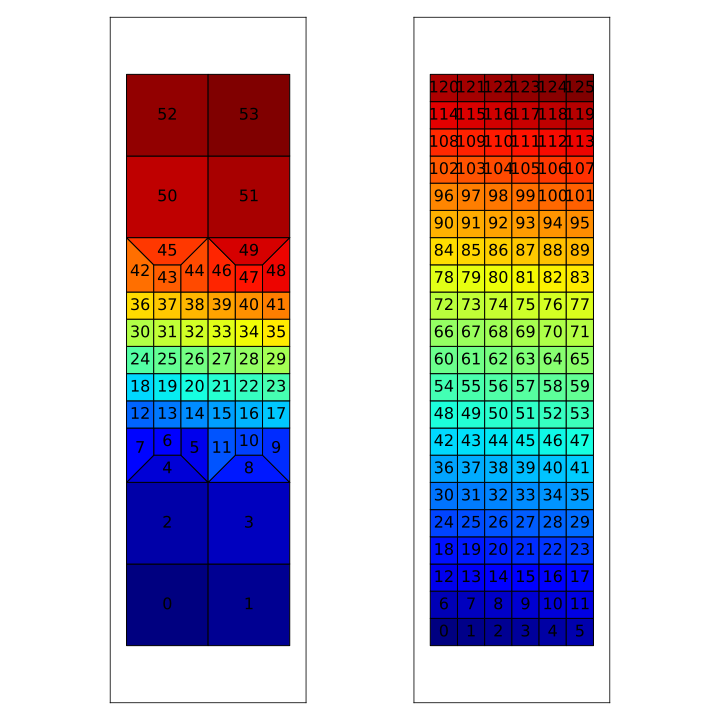

*********************
GooseFEM::Mesh::Quad4
*********************

GooseFEM::Mesh::Quad4::FineLayer
================================

Numbering
---------

[:download:`element-numbers.py <figures/MeshQuad4/FineLayer/element-numbers.py>`]

GooseFEM::Mesh::Quad4::Map::FineLayer2Regular
=============================================

Numbering
---------

[:download:`element-numbers.py <figures/MeshQuad4/Map/FineLayer2Regular/element-numbers.py>`]

Map
---

[:download:`map.py <figures/MeshQuad4/Map/FineLayer2Regular/map.py>`]

.. image:: figures/MeshQuad4/Map/FineLayer2Regular/map.svg
  :width: 500px
  :align: center
