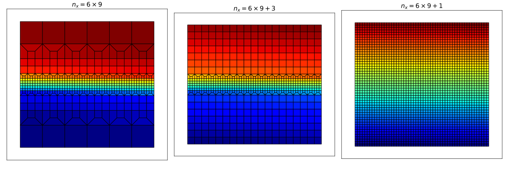
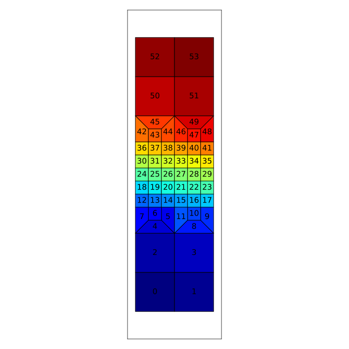
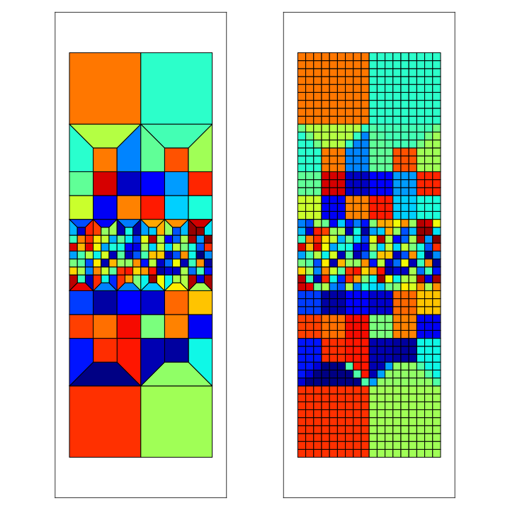

.. _MeshQuad4:

***********
Mesh::Quad4
***********

| :download:`GooseFEM/MeshQuad4.h <../../include/GooseFEM/MeshQuad4.h>`
| :download:`GooseFEM/MeshQuad4.hpp <../../include/GooseFEM/MeshQuad4.hpp>`

Naming convention
=================

.. image:: figures/MeshQuad4/naming_convention.svg
  :width: 350px
  :align: center

Mesh::Quad4::Regular
====================

Regular mesh.

.. seealso::

  | :download:`Python - example <figures/MeshQuad4/Regular/example.py>`

Mesh::Quad4::Regular::nelem()
-----------------------------

Return number of elements.

Mesh::Quad4::Regular::nnode()
-----------------------------

Return number of nodes.

Mesh::Quad4::Regular::nne()
---------------------------

Return number of nodes-per-element (= 3).

Mesh::Quad4::Regular::ndim()
----------------------------

Return number of dimensions (= 2).

Mesh::Quad4::Regular::getElementType()
--------------------------------------

Return element-type.

Mesh::Quad4::Regular::coor()
----------------------------

Return nodal coordinates [nnode, ndim].

Mesh::Quad4::Regular::conn()
----------------------------

Return connectivity [nelem, nne].

Mesh::Quad4::Regular::nodesXXXEdge()
------------------------------------

Node numbers along the "Bottom", "Top", "Left", or "Right" edge.

Mesh::Quad4::Regular::nodesXXXOpenEdge()
----------------------------------------

Node numbers along the "Bottom", "Top", "Left", or "Right" edge, excluding the corners.

Mesh::Quad4::Regular::nodesXXXCorner()
--------------------------------------

Node number of one of the corners (e.g. "BottomLeft").

Mesh::Quad4::Regular::nodesPeriodic()
-------------------------------------

Periodic node pairs. Each row contains on pair of (independent, dependent) node numbers. The output shape is thus [n_pairs, 2].

Mesh::Quad4::Regular::nodesOrigin()
-----------------------------------

Bottom-left node, used as reference for periodicity.

Mesh::Quad4::Regular::dofs()
----------------------------

DOF-numbers for each component of each node (sequential). The output shape is thus [nnode, ndim].

Mesh::Quad4::Regular::dofsPeriodic()
------------------------------------

DOF-numbers for each component of each node, for the case that the periodicity if fully eliminated. The output shape is thus [nnode, ndim].

Mesh::Quad4::Regular::elementMatrix()
-------------------------------------

Return element numbers as matrix [nely, nelx].

Mesh::Quad4::FineLayer
======================

Mesh with a fine layer in the middle, and that becomes course away from this plane (see image below). Note coursening can only be done if the number of elements in horizontal direction is dividable by 3, and that it is only optimal if the number of elements in horizontal direction is a factor of 3. Note that the number of elements in the vertical direction is specified as the number of times the unit element (the number of times "h" the height should be), and that this number is only a target: the algorithm chooses in accordance with the applied coursing.

.. seealso::

  | :download:`Python - example <figures/MeshQuad4/FineLayer/example.py>`
  | :download:`Python - behaviour 'nx' <figures/MeshQuad4/FineLayer/behaviour.py>`
  | :download:`Python - element numbers <figures/MeshQuad4/FineLayer/element-numbers.py>`

Mesh::Quad4::FineLayer::nelem()
-------------------------------

Return number of elements.

Mesh::Quad4::FineLayer::nnode()
-------------------------------

Return number of nodes.

Mesh::Quad4::FineLayer::nne()
-----------------------------

Return number of nodes-per-element (= 3).

Mesh::Quad4::FineLayer::ndim()
------------------------------

Return number of dimensions (= 2).

Mesh::Quad4::FineLayer::nelx()
------------------------------

Number of elements in horizontal direction (along the weak layer) (matches input).

Mesh::Quad4::FineLayer::nely()
------------------------------

Actual number of elements unit elements in vertical direction (actual number of times "h" the mesh is heigh).

Mesh::Quad4::FineLayer::h()
---------------------------

Unit edge size (matches input).

Mesh::Quad4::FineLayer::getElementType()
----------------------------------------

Return element-type.

Mesh::Quad4::FineLayer::coor()
------------------------------

Return nodal coordinates [nnode, ndim].

Mesh::Quad4::FineLayer::conn()
------------------------------

Return connectivity [nelem, nne].

Mesh::Quad4::FineLayer::nodesXXXEdge()
--------------------------------------

Node numbers along the "Bottom", "Top", "Left", or "Right" edge.

Mesh::Quad4::FineLayer::nodesXXXOpenEdge()
------------------------------------------

Node numbers along the "Bottom", "Top", "Left", or "Right" edge, excluding the corners.

Mesh::Quad4::FineLayer::nodesXXXCorner()
----------------------------------------

Node number of one of the corners (e.g. "BottomLeft").

Mesh::Quad4::FineLayer::nodesPeriodic()
---------------------------------------

Periodic node pairs. Each row contains on pair of (independent, dependent) node numbers. The output shape is thus [n_pairs, 2].

Mesh::Quad4::FineLayer::nodesOrigin()
-------------------------------------

Bottom-left node, used as reference for periodicity.

Mesh::Quad4::FineLayer::dofs()
------------------------------

DOF-numbers for each component of each node (sequential). The output shape is thus [nnode, ndim].

Mesh::Quad4::FineLayer::dofsPeriodic()
--------------------------------------

DOF-numbers for each component of each node, for the case that the periodicity if fully eliminated. The output shape is thus [nnode, ndim].

Mesh::Quad4::FineLayer::elementsMiddleLayer()
---------------------------------------------

Element numbers of the middle, fine, layer

Details
-------

Mesh::Quad4::Map::RefineRegular
===============================

Refine a "Regular" mesh.

Mesh::Quad4::Map::RefineRegular::getCoarseMesh()
------------------------------------------------

Return course mesh as "Mesh::Quad4::Regular".

Mesh::Quad4::Map::RefineRegular::getFineMesh()
----------------------------------------------

Return fine mesh as "Mesh::Quad4::Regular".

Mesh::Quad4::Map::RefineRegular::getMap()
-----------------------------------------

Elements of the fine mesh per element of the coarse mesh (rows).

Mesh::Quad4::Map::RefineRegular::mapToCoarse(...)
-------------------------------------------------

Map field to the course mesh:

* Scalar per element.
* Scalar per integration point.
* Tensor per integration point.

Mesh::Quad4::Map::RefineRegular::mapToFine(...)
-----------------------------------------------

Map field to the fine mesh:

* Scalar per element.
* Scalar per integration point.
* Tensor per integration point.

Mesh::Quad4::Map::FineLayer2Regular
===================================

Map "Regular" mesh to "FineLayer" mesh.

.. seealso::

  | :download:`Python - map <figures/MeshQuad4/Map/FineLayer2Regular/map.py>`
  | :download:`Python - element numbers <figures/MeshQuad4/Map/FineLayer2Regular/element-numbers.py>`

Mesh::Quad4::Map::FineLayer2Regular::getCoarseMesh()
----------------------------------------------------

Return course mesh as "Mesh::Quad4::Regular".

Mesh::Quad4::Map::FineLayer2Regular::getFineMesh()
--------------------------------------------------

Return fine mesh as "Mesh::Quad4::Regular".

Mesh::Quad4::Map::FineLayer2Regular::getMap()
---------------------------------------------

Elements of the fine mesh per element of the coarse mesh (rows).

Mesh::Quad4::Map::FineLayer2Regular::getMapFraction()
-----------------------------------------------------

Get the fraction of overlap for the output of "getMap()".

Mesh::Quad4::Map::FineLayer2Regular::mapToRegular(...)
------------------------------------------------------

Map field to the course mesh:

* Scalar per element.
* Scalar per integration point.
* Tensor per integration point.
