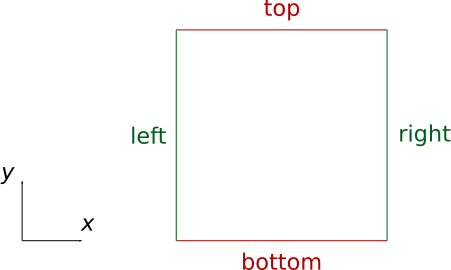

**********
Mesh::Tri3
**********

| :download:`GooseFEM/MeshTri3.h <../../include/GooseFEM/MeshTri3.h>`
| :download:`GooseFEM/MeshTri3.hpp <../../include/GooseFEM/MeshTri3.hpp>`

Naming convention
=================

Mesh::Tri3::Regular
===================

Regular mesh.

.. seealso::

  | :download:`Python - example <figures/MeshTri3/Regular/example.py>`

Mesh::Tri3::Regular::nelem()
----------------------------

Return number of elements.

Mesh::Tri3::Regular::nnode()
----------------------------

Return number of nodes.

Mesh::Tri3::Regular::nne()
--------------------------

Return number of nodes-per-element (= 3).

Mesh::Tri3::Regular::ndim()
---------------------------

Return number of dimensions (= 2).

Mesh::Tri3::Regular::getElementType()
-------------------------------------

Return element-type.

Mesh::Tri3::Regular::coor()
---------------------------

Return nodal coordinates [nnode, ndim].

Mesh::Tri3::Regular::conn()
---------------------------

Return connectivity [nelem, nne].

Mesh::Tri3::Regular::nodesXXXEdge()
-----------------------------------

Node numbers along the "Bottom", "Top", "Left", or "Right" edge.

Mesh::Tri3::Regular::nodesXXXOpenEdge()
---------------------------------------

Node numbers along the "Bottom", "Top", "Left", or "Right" edge, excluding the corners.

Mesh::Tri3::Regular::nodesXXXCorner()
-------------------------------------

Node number of one of the corners (e.g. "BottomLeft").

Mesh::Tri3::Regular::nodesPeriodic()
------------------------------------

Periodic node pairs. Each row contains on pair of (independent, dependent) node numbers. The output shape is thus [n_pairs, 2].

Mesh::Tri3::Regular::nodesOrigin()
----------------------------------

Bottom-left node, used as reference for periodicity.

Mesh::Tri3::Regular::dofs()
---------------------------

DOF-numbers for each component of each node (sequential). The output shape is thus [nnode, ndim].

Mesh::Tri3::Regular::dofsPeriodic()
-----------------------------------

DOF-numbers for each component of each node, for the case that the periodicity if fully eliminated. The output shape is thus [nnode, ndim].

Mesh::Tri3::getOrientation(...)
===============================

Get the orientation (-1 or +1) of all the elements.

Mesh::Tri3::setOrientation(...)
===============================

Set the orientation (-1 or +1) of all the elements.
