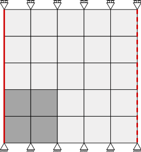

*************
Semi-periodic
*************

Consider a "rheometer" which corresponds to a torus, in which a linear elastic material is placed
consists of two phases.
In terms of boundary conditions this implies taking the geometry periodic in horizontal direction,
while the displacements of the top and bottom boundary are controlled.
For simplicity two-dimensional plane strain is considered.

|

Below the important difference with respect to the previous example are discussed.
The full example can be downloaded:

| :download:`CMakeLists.txt <statics/MixedPeriodic_LinearElastic/CMakeLists.txt>`
| :download:`example.cpp <statics/MixedPeriodic_LinearElastic/example.cpp>`
| :download:`plot.py <statics/MixedPeriodic_LinearElastic/plot.py>`

.. todo::

    Compile and run instructions.

.. note::

    The same example is available using the Python interface:
    :download:`example.py <statics/MixedPeriodic_LinearElastic/example.py>`

Node sets
=========

.. literalinclude:: statics/MixedPeriodic_LinearElastic/example.cpp
    :language: cpp
    :lines: 25-28
    :emphasize-lines: 1-2

We will apply periodicity to all the nodes along the left and right boundary of the geometry.
The corner nodes are thereby assigned the fixed displacement (that is itself taken periodic).

Apply periodicity
=================

.. literalinclude:: statics/MixedPeriodic_LinearElastic/example.cpp
    :language: cpp
    :lines: 33-37

Applying periodicity in this case is rather straightforward.
In particular the degrees-of-freedom along the right edge are eliminated,
and replaced by the degrees-of-freedom of the left edge.
The size of the actually solved system is therefore reduced, while the response vectors are
simply assembled to both sides of the geometry.

Fixed displacement
==================

.. literalinclude:: statics/MixedPeriodic_LinearElastic/example.cpp
    :language: cpp
    :lines: 38-43

The degrees-of-freedom of which the displacement is controlled are finally extracted
from the renumbered list of degrees-of-freedom.
