.. _fem_examples_small-strain_linear_dense:

******************************
Linear statics -- small strain
******************************

.. contents:: **Contents**
  :local:
  :depth: 2
  :backlinks: top

Mixed boundary conditions
=========================

[:download:`source: fixedbnd-basic.cpp <fixedbnd-basic.cpp>`]

[:download:`source: fixedbnd.cpp <fixedbnd.cpp>`]

Problem description
-------------------

In this first example we will look at a linear elastic, 2-D plane strain problem, with imposed boundary displacements. The problem is sketched in the figure below. From which it is observed that:

1.  The sample is homogeneous.

2.  Symmetry conditions are assumed in :math:`x`- and :math:`y`-direction.

3.  The outer (right) edge is displaced by :math:`\lambda` in :math:`x`-direction (whereby the displacement is constant in :math:`y`-direction).

4.  The boundary tractions are zero everywhere, except for where the displacement is prescribed. There a non-zero reaction force may appear.

5.  (Not shown) We assume that :math:`\Omega = \Omega_0`, and thus :math:`\nabla = \nabla_0`. By doing this we can make the problem truly linear.

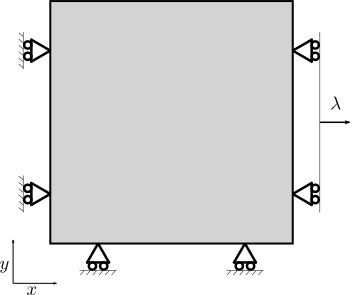

The geometry is discretized in 2-D linear quadrilateral elements, which have four nodes per element. To keep things simple we use only three, equi-sized, elements in each direction. The mesh is shown below, whereby the element numbers have a regular font while the node numbers are italic.

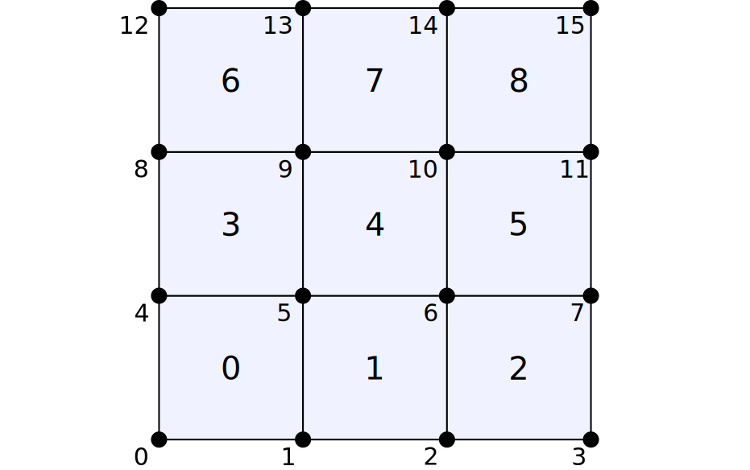

At this point we focus our attention on the internal force. Thereby we first consider the constitutive response:

.. math::

  \bm{\sigma} = \mathbb{C} : \bm{\varepsilon}

I.e the double contraction between the fourth-order stiffness

.. math::

  \mathbb{C} = K \bm{I} \otimes \bm{I} + 2 G (  \mathbb{I}_\mathrm{s} - \tfrac{1}{3} \bm{I} \otimes \bm{I} ) = K \bm{I} \otimes \bm{I} + 2 G \, \mathbb{I}_\mathrm{d}

(with :math:`K` and :math:`G` the bulk and the shear modulus), and the linear strain

.. math::

  \bm{\varepsilon}
  =
  \tfrac{1}{2} \big[\, \vec{\nabla}_0\vec{u} + [\, \vec{\nabla}_0\vec{u} \,]^T \,\big]

(more information in the `documentation of GooseSolid <https://github.com/tdegeus/GooseSolid/blob/master/docs/LinearElastic/LinearElastic.pdf>`_). Because of the symmetries in :math:`\mathbb{C}` we can simplify the constitutive expression as follows

.. math::

  \bm{\sigma} = \mathbb{C} : \big[\, \vec{\nabla}_0\vec{u} \,\big]

The displacement of the final configuration, :math:`\vec{u}`, is now decomposed some known *pre-strain* :math:`\vec{u}_{(0)}` plus an unknown update :math:`\delta \vec{u}`:

.. math::

  \vec{u} = \vec{u}_{(0)} + \delta \vec{u}

.. note::

  For our simple problem, which is initially stress and strain free, we find that

  .. math::

    \underline{\vec{f}}_{(0)} = \underline{\vec{t}}_{(0)} = \underline{\vec{u}}_{(0)} = \vec{0}

  Some of the above expressions could thus be simplified further, while also part of the implementation can be omitted. We keep it here to build on this problem later on.

For the internal force this implies that

.. math::

  \underline{\vec{f}}(\vec{u}) = \underline{\vec{f}}(\vec{u}_{(0)}) + \underline{\vec{f}}(\delta \vec{u})
  \qquad
  \mathrm{or}
  \qquad
  \underline{\vec{f}} = \underline{\vec{f}}_{(0)} + \delta \underline{\vec{f}}

Since :math:`\vec{u}_{(0)}` is known we easily evaluate the original (in principle non-linear) expression of the internal force:

.. math::

  \underline{\vec{f}}_{(0)}
  =
  \int\limits_{\Omega^h_0}
    \big[\, \vec{\nabla}_0 \underline{N} \,\big]
    \cdot
    \bm{\sigma}\big( \vec{u}_{(0)} \big) \;
  \mathrm{d}\Omega

For the update we use the explicit relation for the stress

.. math::

  \delta \underline{\vec{f}}
  =
  \int\limits_{\Omega^h_0}
    \big[\, \vec{\nabla}_0 \underline{N} \,\big]
    \cdot
    \bm{\sigma}\big( \delta \vec{u} \big) \;
  \mathrm{d}\Omega
  =
  \int\limits_{\Omega^h_0}
    \big[\, \vec{\nabla}_0 \underline{N} \,\big]
    \cdot
    \mathbb{C}
    :
    \big[\, \vec{\nabla}_0 \, \delta \vec{u} \,\big] \;
  \mathrm{d}\Omega

We then again apply our discretization scheme to obtain

.. math::

  \delta \underline{\vec{f}}
  =
  \int\limits_{\Omega^h_0}
    \big[\, \vec{\nabla}_0 \underline{N} \,\big]
    \cdot
    \mathbb{C}
    \cdot
    \big[\, \vec{\nabla}_0 \underline{N} \,\big]^\mathsf{T}
  \mathrm{d}\Omega
  \cdot
  \delta \underline{u}

Hence:

.. math::

  \underline{\vec{f}}
  =
  \underline{\vec{f}}_{(0)} + \underline{\underline{\bm{K}}}_{(0)} \cdot \delta \underline{\vec{u}}

The tractions :math:`\underline{\vec{t}}_{(0)}` are fully given by the boundary conditions, which also can be used to show that :math:`\delta \underline{\vec{t}} = \underline{\vec{0}}` -- or at least for the relevant components (see below). The final force balance then reads:

.. math::

  \underline{\underline{\bm{K}}}_{(0)} \cdot \delta \underline{\vec{u}}
  =
  \underline{\vec{t}}_{(0)} - \underline{\vec{f}}_{(0)}

We continue, by writing the problem in terms of scalar degrees-of-freedoms (DOFs). Each node has two DOFs, the two vector directions. For our mesh we define the DOFs as follows (whereby the cyan colored DOF-numbers correspond to the :math:`x`-direction, while the magenta ones correspond to the :math:`y`-direction).

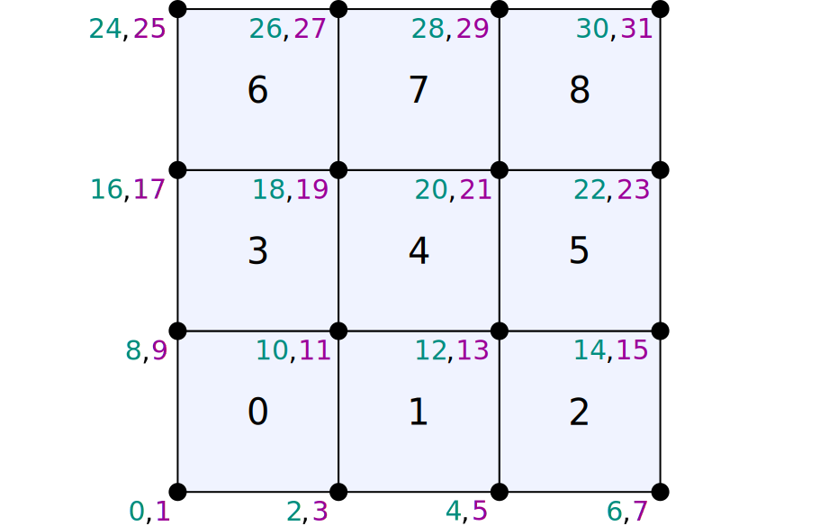

By doing this, a little bit of book-keeping allows us to write our balance equation as the following system of equations

.. math::

  \underline{\underline{K}}_{(0)}\, \delta \underline{u}
  =
  \underline{t}_{(0)} - \underline{f}_{(0)}

In short

.. math::

  \underline{\underline{K}}_{(0)}\, \delta \underline{u} = \underline{r}_{(0)}

Next, we have to impose the boundary conditions. Given the fact that we impose displacements on part of the boundary here, a part of :math:`\delta \underline{\vec{u}}` will be prescribed. More specifically, our mesh looks as follows

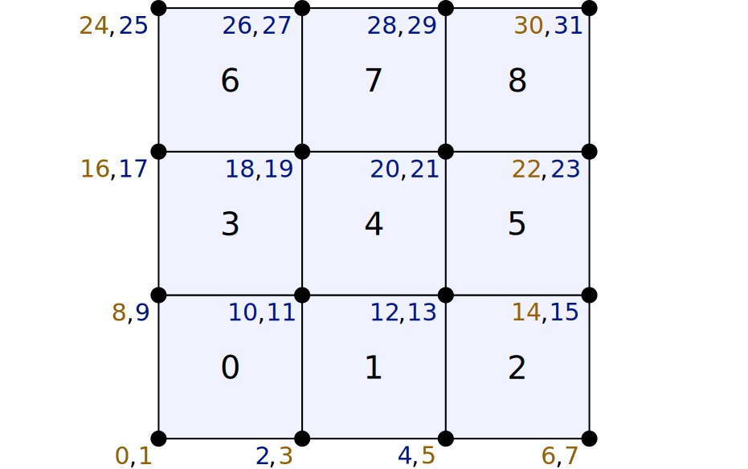

where the yellow nodes are prescribed DOFs while the blue ones are yet unknown. We are now ready to solve the balance equation in two steps. First we will partition the system is unknown and prescribed DOFs:

.. math::

  \begingroup
  \renewcommand*{\arraystretch}{1.5}
  \begin{bmatrix}
    \underline{\underline{K}}_{uu} & \underline{\underline{K}}_{up} \\
    \underline{\underline{K}}_{pu} & \underline{\underline{K}}_{pp}
  \end{bmatrix}
  \begin{bmatrix}
    \delta \underline{u}_{u} \\
    \delta \underline{u}_{p}
  \end{bmatrix}
  =
  \begin{bmatrix}
    \underline{r}_{u} \\
    \underline{r}_{p}
  \end{bmatrix}
  \endgroup

We are now ready to solve the former part:

.. math::

  \delta \underline{u}_{u} = \underline{\underline{K}}_{uu}^{-1} \big( \underline{r}_{u} - \underline{\underline{K}}_{up} \delta \underline{u}_{p} \big)

which gives us that

.. math::

  \delta \underline{u}
  =
  \begingroup
  \renewcommand*{\arraystretch}{1.5}
  \begin{bmatrix}
    \delta \underline{u}_{u} \\
    \delta \underline{u}_{p}
  \end{bmatrix}
  \endgroup

and finally that

.. math::

  \underline{u} = \underline{u}_{(0)} + \delta \underline{u}

which can be reassembled as displacement vectors per node, :math:`\underline{\vec{u}}`.

Should you be interested, one can compute the *reaction force*, i.e. the boundary tractions there where the displacement has been prescribed. One has to do the following:

.. math::

  \underline{t}_{p} = \underline{f}_{p}

For this, one thus has to compute the new :math:`\underline{\vec{f}}(\vec{u})`. Because this specific model is linear we can however obtain the reaction forces without having to re-evaluate :math:`\underline{\vec{f}}`. Specifically

.. math::

  \underline{t}_{p} = \underline{f}_{p} = (\underline{f}_{(0)})_{p} + \underline{\underline{K}}_{pu} \delta \underline{u}_{u} + \underline{\underline{K}}_{pp} \delta \underline{u}_{p}

Basic implementation
--------------------

[:download:`source: fixedbnd-basic.cpp <fixedbnd-basic.cpp>`]

Our first attempt of an implementation literately follows the steps above: it constructs :math:`\underline{\underline{K}}` and :math:`\underline{f}`, which are then partitioned. The prescribed displacements are then set. Thereafter the problem is solved, and the displacements are reconstructed to nodal vector for easy post-processing.

Pre-partitioning
----------------

[:download:`source: fixedbnd.cpp <fixedbnd.cpp>`]

One of the things that made the previous examples not very suitable for becoming a production code is the fact that the stiffness matrix was first fully assembled and afterwards partitioned. Besides costing a lot of memory for storing the matrix twice, it might cost a lot of time since partitioning might become a costly operation in the case that sparse matrices are used. To avoid this, the system may be pre-partioned. In that case we renumber the DOFs such that we end up with first all the unknown DOFs (denoted ``iiu`` in the code), and then all the known DOFs (denoted ``iip``). For our example this results in:

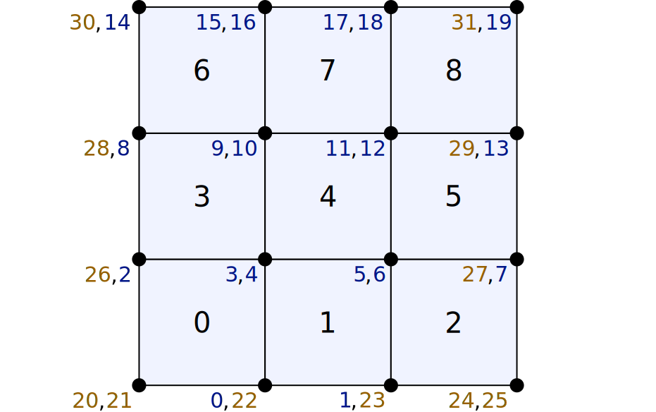

This allows us to consider four different matrices (denoted using ``_uu``, ``_up``, ``_pu``, and ``_pp``) and two different columns (denoted using ``_u`` and ``_p``) to which the internal force and the stiffness are directly assembled. The rows (and columns) of these matrices and columns follow from introducing separate indices for ``iiu`` and ``iip``:

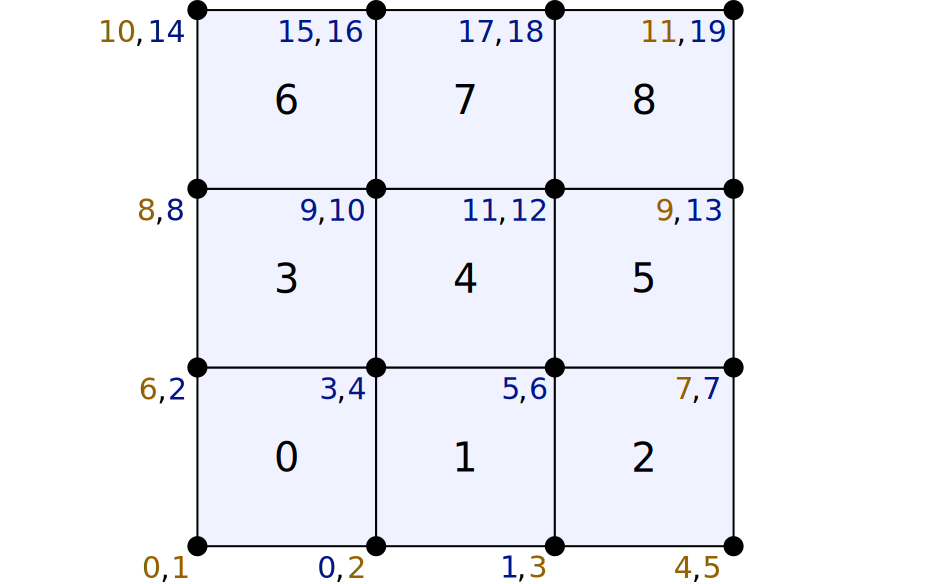

Periodic boundary conditions
============================

.. note::

  Some additional notes on the theory discussed on a simplified scalar system, for the same mesh as presented here, are included in a separate document. One is invited to study this document before continuing.

  [:download:`source: readme.pdf <periodic/system/readme.pdf>`]

Prescribed macroscopic deformation
----------------------------------

[:download:`source: periodic.cpp <periodic.cpp>`]

In our first example we will consider the same material and mesh as above. However, now we will assume periodicity is both spatial directions and prescribe a change in the macroscopic deformation gradient, equal to

.. math::

  \Delta \bm{F}
  =
  \begingroup
  \renewcommand*{\arraystretch}{1.5}
  \begin{bmatrix}
    0 & 0.01 \\
    0 & 0
  \end{bmatrix}
  \endgroup

First of all we will specify periodicity for our mesh. It applies that the following equalities hold (in terms of node numbers:

.. math::

  \vec{u}^\star_{ 3} &= \vec{u}^\star_{ 0} \\
  \vec{u}^\star_{ 7} &= \vec{u}^\star_{ 4} \\
  \vec{u}^\star_{11} &= \vec{u}^\star_{ 8} \\
  \vec{u}^\star_{12} &= \vec{u}^\star_{ 0} \\
  \vec{u}^\star_{13} &= \vec{u}^\star_{ 1} \\
  \vec{u}^\star_{14} &= \vec{u}^\star_{ 2} \\
  \vec{u}^\star_{15} &= \vec{u}^\star_{ 0}

where :math:`\vec{u}^\star` are the microscopic fluctuations, that do not affect the macroscopic affine deformation. In terms of DOFs this is can be illustrated as follows:

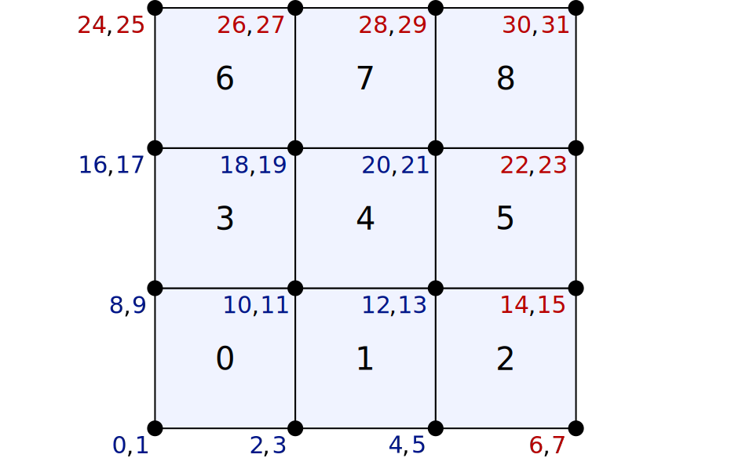

where the red DOFs are said to be dependent (i.e. they directly follow from the equalities listed above). The simplest this that we can do is construct a system with only the independent DOFs (in blue above) by directly assembling to the independent DOFs. To this end we employ the following DOF numbers:

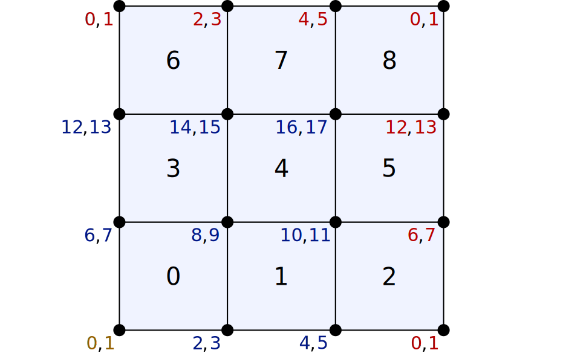

where the yellow color of the lower left corner indicates that this node is used as reference. Firstly it is used to suppress rigid body deformation. Secondly we apply the macroscopic deformation as the initial condition.

.. math::

  \underline{\vec{u}}_{(0)} = \Delta \bm{F} \cdot \big[\, \underline{\vec{X}} - \vec{X}_\mathrm{ref} \,\big]

Final equilibrium is then obtained by solving

.. math::

  \underline{\underline{K}}^\star_{(0)}\, \delta \underline{u}^\star
  =
  - \underline{f}^\star_{(0)}

(which has the dimensions of the number of independent DOFs), and then assembling :math:`\delta \underline{u}^\star` to the entire system (including the dependent nodes). This is done in the first example, whereby the resulting system is partitioned to deal with the zero-displacement of the reference node.

Mixed macroscopic boundary conditions
-------------------------------------

[:download:`source: periodic-virtual-basic.cpp <periodic-virtual-basic.cpp>`]

Here we will enable mixed macroscopic boundary conditions by introduction extra DOFs for the macroscopic deformation gradient tensor, and its antagonist stress response. Since we work in two dimensions we introduce two virtual nodes, each with two DOFs:

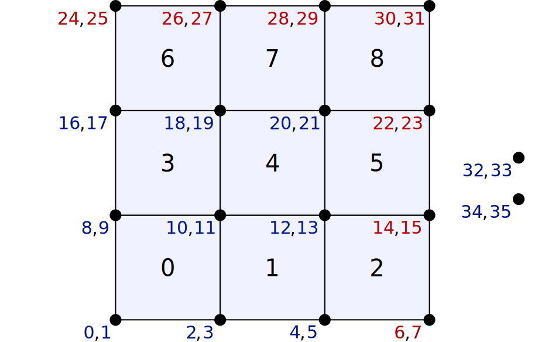

We will now employ the following tying relation

.. math::

  \vec{x}_{d} &= \vec{x}_{i} + \bm{F} \cdot ( \vec{X}_{d} - \vec{X}_{i} )
  \\
  \vec{u}_{d} &= \vec{u}_{i} + ( \bm{F} - \bm{I} ) \cdot ( \vec{X}_{d} - \vec{X}_{i} )

To this end we first renumber the system to have all the dependent DOFs at the end

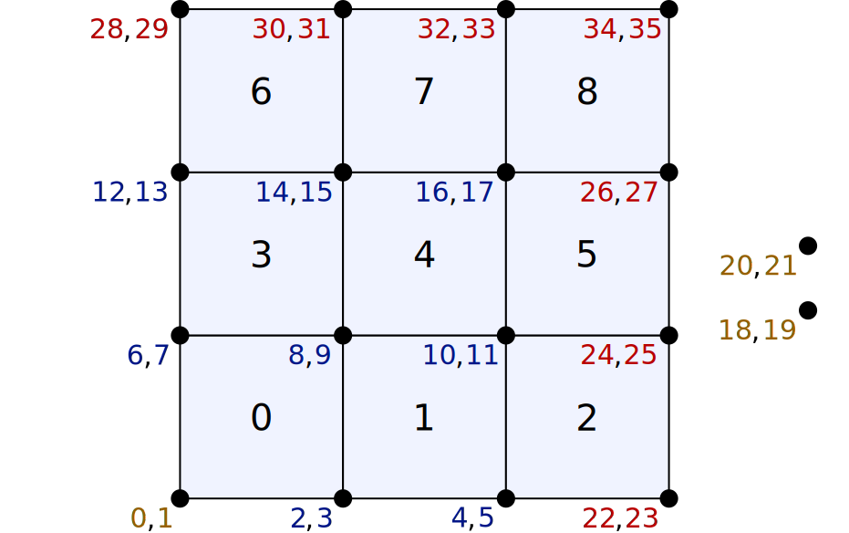

And then partition the system in independent and dependent DOFs

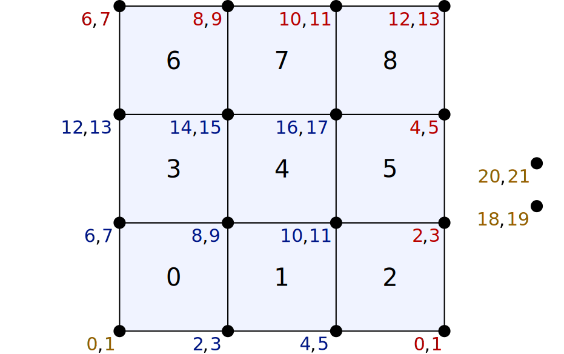

Finally, we obtain the following tying relations for the DOFs

.. math::

  \underline{\underline{C}}_{di} =
  \left[
  \begin{array}{cccccccccccccccccccccc}
  % 0   1   2   3   4   5   6   7   8   9  10  11  12  13  14  15  16  17   18    19    20    21
    1 & . & . & . & . & . & . & . & . & . & . & . & . & . & . & . & . & . & L_x & 0   & .   & .   \\
    . & 1 & . & . & . & . & . & . & . & . & . & . & . & . & . & . & . & . & .   & .   & L_x & 0   \\
    . & . & . & . & . & . & 1 & . & . & . & . & . & . & . & . & . & . & . & L_x & 0   & .   & .   \\
    . & . & . & . & . & . & . & 1 & . & . & . & . & . & . & . & . & . & . & .   & .   & L_x & 0   \\
    . & . & . & . & . & . & . & . & . & . & . & . & 1 & . & . & . & . & . & L_x & 0   & .   & .   \\
    . & . & . & . & . & . & . & . & . & . & . & . & . & 1 & . & . & . & . & .   & .   & L_x & 0   \\
    1 & . & . & . & . & . & . & . & . & . & . & . & . & . & . & . & . & . & 0   & L_y & .   & .   \\
    . & 1 & . & . & . & . & . & . & . & . & . & . & . & . & . & . & . & . & .   & .   & 0   & L_y \\
    . & . & 1 & . & . & . & . & . & . & . & . & . & . & . & . & . & . & . & 0   & L_y & .   & .   \\
    . & . & . & 1 & . & . & . & . & . & . & . & . & . & . & . & . & . & . & .   & .   & 0   & L_y \\
    . & . & . & . & 1 & . & . & . & . & . & . & . & . & . & . & . & . & . & 0   & L_y & .   & .   \\
    . & . & . & . & . & 1 & . & . & . & . & . & . & . & . & . & . & . & . & .   & .   & 0   & L_y \\
    1 & . & . & . & . & . & . & . & . & . & . & . & . & . & . & . & . & . & L_x & L_y & .   & .   \\
    . & 1 & . & . & . & . & . & . & . & . & . & . & . & . & . & . & . & . & .   & .   & L_x & L_y \\
  \end{array}
  \right]

We then employ the nodal dependency to obtain a system of the independent DOFs only:

.. math::

  \left[
  \underline{\underline{K}}^{(0)}_{ii}
  +
  \underline{\underline{C}}_{di}^\mathsf{T}
  \underline{\underline{K}}^{(0)}_{di}
  +
  \underline{\underline{C}}_{di}^\mathsf{T}
  \underline{\underline{K}}^{(0)}_{dd}
  \underline{\underline{C}}_{di}
  \right]
  \,
  \delta \underline{u}^\star_{i}
  =
  -
  \left[
  \underline{f}^{(0)}_{i}
  +
  \underline{\underline{C}}_{di}^\mathsf{T}
  \underline{f}^{(0)}_{d}
  \right]

which, after solving, we can reconstruct to the dependent DOFs using

.. math::

  \delta \underline{u}^\star_{d}
  =
  \underline{\underline{C}}_{di}
  \delta \underline{u}^\star_{i}

.. note:: **Towards a production code**

  Although not (yet) pursued here, it would make sense to partition the system as follows:

  .. math::

    \begingroup
    \renewcommand*{\arraystretch}{1.5}
    \begin{bmatrix}
      \underline{\underline{K}}_{uu} &
      \underline{\underline{K}}_{up} &
      \underline{\underline{K}}_{ud}
      \\
      \underline{\underline{K}}_{pu} &
      \underline{\underline{K}}_{pp} &
      \underline{\underline{K}}_{pd}
      \\
      \underline{\underline{K}}_{du} &
      \underline{\underline{K}}_{dp} &
      \underline{\underline{K}}_{dd}
    \end{bmatrix}
    \begin{bmatrix}
      \delta \underline{u}_{u} \\
      \delta \underline{u}_{p} \\
      \delta \underline{u}_{d}
    \end{bmatrix}
    =
    -
    \begin{bmatrix}
      \underline{f}_{u} \\
      \underline{f}_{p} \\
      \underline{f}_{d}
    \end{bmatrix}
    \endgroup

  Accompanied with the tying relations

  .. math::

    \begingroup
    \renewcommand*{\arraystretch}{1.5}
    \begin{bmatrix}
      \underline{\underline{C}}_{du} &
      \underline{\underline{C}}_{dp}
    \end{bmatrix}
    \endgroup

  And use the following condensation

  .. math::

    \begingroup
    \renewcommand*{\arraystretch}{1.5}
    \begin{bmatrix}
      \underline{\underline{K}}^{(0)}_{uu} +
      \underline{\underline{C}}_{du}^\mathsf{T} \underline{\underline{K}}^{(0)}_{du} +
      \underline{\underline{C}}_{du}^\mathsf{T} \underline{\underline{K}}^{(0)}_{dd}
      \underline{\underline{C}}_{du}
      &
      \underline{\underline{K}}^{(0)}_{up} +
      \underline{\underline{C}}_{du}^\mathsf{T} \underline{\underline{K}}^{(0)}_{dp} +
      \underline{\underline{C}}_{du}^\mathsf{T} \underline{\underline{K}}^{(0)}_{dd}
      \underline{\underline{C}}_{dp}
      \\
      \underline{\underline{K}}^{(0)}_{pu} +
      \underline{\underline{C}}_{dp}^\mathsf{T} \underline{\underline{K}}^{(0)}_{du} +
      \underline{\underline{C}}_{dp}^\mathsf{T} \underline{\underline{K}}^{(0)}_{dd}
      \underline{\underline{C}}_{du}
      &
      \underline{\underline{K}}^{(0)}_{pp} +
      \underline{\underline{C}}_{dp}^\mathsf{T} \underline{\underline{K}}^{(0)}_{dp} +
      \underline{\underline{C}}_{dp}^\mathsf{T} \underline{\underline{K}}^{(0)}_{dd}
      \underline{\underline{C}}_{dp}
    \end{bmatrix}
    \begin{bmatrix}
      \delta \underline{u}^\star_{u} \\
      \delta \underline{u}^\star_{p}
    \end{bmatrix}
    =
    -
    \begin{bmatrix}
      \underline{f}^{(0)}_{u} +
      \underline{\underline{C}}_{du}^\mathsf{T} \underline{f}^{(0)}_{d}
      \\
      \underline{f}^{(0)}_{p} +
      \underline{\underline{C}}_{dp}^\mathsf{T} \underline{f}^{(0)}_{d}
    \end{bmatrix}
    \endgroup

  with the following reconstruction:

  .. math::

    \delta \underline{u}^\star_{d}
    =
    \underline{\underline{C}}_{du} \delta \underline{u}^\star_{u}
    +
    \underline{\underline{C}}_{dp} \delta \underline{u}^\star_{p}

