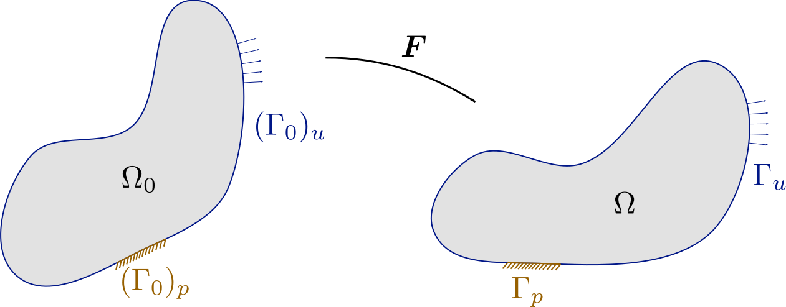
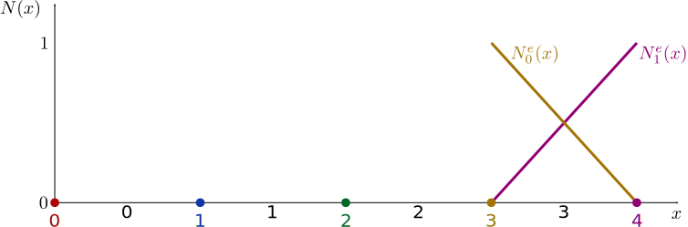

*********************
Finite Element Method
*********************

.. contents:: **Contents**
  :local:
  :depth: 2
  :backlinks: top

In the sequel the theory of the Finite Element is discussed in a compact way. This discussion is by no means comprehensive. Therefore one is invited to dive in more complete textbooks. The key contribution of this reader is that it is supported by many examples that can be easily extended and customized into efficient, production-ready code. To this end, the examples are in C++14, and are specifically written such that they are mostly 'what you see is what you get'. The entire structure is in the main-file, and not hidden somewhere in a library. To simplify your life we do use several libraries, each of which, however, only with a dedicated task, which can be understood, used, and checked independently of the Finite Element Method or any specific application. More specifically we use:

*   `GooseMaterial <https://github.com/tdegeus/GooseMaterial>`_

    Provides the constitutive response (and optionally the constitutive tangent) of several materials.

*   `cppmat <https://github.com/tdegeus/cppmat>`_

    Provides tensor classes and operations. (The number of tensor operations are limited in the main program, and even non-standard, but this library is crucial to compute the material response implemented in `GooseMaterial <https://github.com/tdegeus/GooseMaterial>`_.)

*   `Eigen3 <http://eigen.tuxfamily.org/index.php?title=Main_Page>`_

    A linear algebra library. As you will notice, Eigen plays an important role in GooseFEM, and glues everything together since in the end the Finite Element Method is just a way to cast a problem into a set linear or linearized equations. Most of the efficiency of the final program will depend on the efficiency of the implementation of the linear algebra. In several examples we will simplify the structure by using dense matrices together with a simple solver which solves the resulting linear system. In reality one should always use sparse matrices combined with a more efficient solver. As you will notice, many examples need only few changes to be transformed in a production code.

.. note:: **Compilation**

  Unless otherwise mentioned, the examples can be compiled as follows. Provided that ``pkg-config`` is set-up correctly one can use

  .. code-block:: bash

    clang++ `pkg-config --cflags Eigen3 cppmat GooseMaterial GooseFEM` -std=c++14 -o example example_name.cpp

  (whereby ``clang++`` can be replaced by for example ``g++``). If one does not want to use ``pkg-config``, one has to specify ``-I/path/to/library`` for each of the libraries.

  For further development it is strongly advised to include the options ``-Wpedantic -Wall`` to get on top of mistakes. Once the code is ready, one should compile with optimization (``-O3``) and without assertions (``-DNDEBUG``). The `Eigen3 documentation <http://eigen.tuxfamily.org/index.php?title=FAQ#How_can_I_enable_vectorization.3F>`_ further recommends the option ``-march=native`` to enable vectorization optimized for you architecture.

Statics
=======

The conceptual idea
-------------------

We begin our discussion by considering a static, solid mechanics, problem. Loosely speaking the goal is to find a deformation map, :math:`\vec{x} = \varphi(\vec{X},t)`, that maps a body :math:`\Omega_0` to a deformed state :math:`\Omega` that satisfies equilibrium and the boundary conditions applied on :math:`\Gamma`.

As is the case in the illustration, the body can be subjected to two kinds of boundary conditions:

*  *Essential* or *Dirichlet* boundary conditions on :math:`\Gamma_p`, whereby the displacements are prescribed.
*  *Natural* or *Neumann* boundary conditions on :math:`\Gamma_u`, whereby the tractions are prescribed. (Whereby traction-free is also perfectly acceptable.)

In practice, we are not explicitly looking for the map :math:`\vec{x} = \varphi(\vec{X},t)`, but for the deformation gradient :math:`\bm{F}`,  or in fact for a displacement field :math:`\vec{u} = \vec{x} - \vec{X}`. To make things a bit more explicit, the deformation gradient is defined as follows:

.. math::

  \vec{x} = \bm{F} \cdot \vec{X}

hence

.. math::

  \bm{F}
  =
  \frac{\partial \varphi}{\partial \vec{X}}
  =
  \big( \vec{\nabla}_0 \, \vec{x} \big)^T
  =
  \bm{I} + \big( \vec{\nabla}_0 \, \vec{u} \big)^T

Momentum balance
----------------

We start from the linear momentum balance:

.. math::

  \vec{\nabla} \cdot \bm{\sigma}(\vec{x}) = \vec{0}
  \qquad
  \vec{x} \in \Omega

where :math:`\bm{\sigma}` is the Cauchy stress which depends on the new position :math:`\vec{x}` and thus on the displacement :math:`\vec{u}`. It has been assumed that all actions are instantaneous (no inertia) and, for simplicity, that there are no body forces. Loosely speaking the interpretation of this equation is that *the sum of all forces vanishes* everywhere in the domain :math:`\Omega`

.. note::

  The following nomenclature has been used

  .. math::

    \vec{\nabla} \cdot \bm{\sigma} = \frac{ \partial \sigma_{ij} }{ \partial x_i }

The crux of the Finite Element Method is that this non-linear differential equation is solved in a weak sense. I.e.

.. math::

  \int\limits_\Omega
    \vec{\phi}(\vec{X}) \cdot \big[\, \vec{\nabla} \cdot \bm{\sigma}(\vec{x}) \,\big] \;
  \mathrm{d}\Omega
  =
  0
  \qquad
  \forall \; \vec{\phi}(\vec{X}) \in \mathbb{R}^d

where :math:`\vec{\phi}` are test functions. For reasons that become obvious below, we apply integration by parts, which results in

.. math::

  \int\limits_\Omega
    \big[\, \vec{\nabla} \vec{\phi}(\vec{X}) \,\big] : \bm{\sigma}(\vec{x}) \;
  \mathrm{d}\Omega
  =
  \int\limits_\Omega
    \vec{\nabla}
    \cdot
    \big[\, \vec{\phi}(\vec{X}) \cdot \bm{\sigma}(\vec{x}) \,\big] \;
  \mathrm{d}\Omega
  \qquad
  \forall \; \vec{\phi}(\vec{X}) \in \mathbb{R}^d

.. note::

  Use has been made of the following chain rule

  ..  math::

    \vec{\nabla} \cdot \big[\, \vec{\phi} \cdot \bm{\sigma}^T \,\big]
    =
    \big[\, \vec{\nabla} \vec{\phi} \,\big] : \bm{\sigma}^T
    +
    \vec{\phi} \cdot \big[\, \vec{\nabla} \cdot \bm{\sigma} \,\big]

  together with the symmetry of the Cauchy stress

  .. math::

    \bm{\sigma} = \bm{\sigma}^T

  and the following nomenclature:

  .. math::

    C = \bm{A} : \bm{B} = A_{ij} B_{ji}

The right-hand side of this equation can be reduced to an area integral by employing Gauss's divergence theorem. The result reads

.. math::

  \int\limits_\Omega
    \big[\, \vec{\nabla} \vec{\phi}(\vec{X}) \,\big] : \bm{\sigma}(\vec{x}) \;
  \mathrm{d}\Omega
  =
  \int\limits_\Gamma
    \vec{\phi}(\vec{X}) \cdot
    \underbrace{
      \vec{n}(\vec{x}) \cdot \bm{\sigma}(\vec{x})
    }_{
      \vec{t}(\vec{x})
    } \;
  \mathrm{d}\Gamma
  \qquad
  \forall \; \vec{\phi}(\vec{X}) \in \mathbb{R}^d

.. note::

  Gauss's divergence theorem states that

  .. math::

    \int\limits_\Omega \vec{\nabla} \cdot \vec{a}(\vec{x}) \; \mathrm{d}\Omega
    =
    \int\limits_\Gamma \vec{n}(\vec{x}) \cdot \vec{a}(\vec{x}) \; \mathrm{d}\Gamma

  where :math:`\vec{n}` is the normal along the surface :math:`\Gamma`.

Discretization
--------------

The problem is now discretized using :math:`n` *nodes* that are connected through *elements*, which define the discretized domain :math:`\Omega^h_0`. `Shape functions`_ :math:`N_i(\vec{X})` are used to extrapolate the nodal quantities throughout the domain :math:`\Omega^h_0` (and :math:`\Omega^h`), as follows:

.. math::

  \vec{x}(\vec{X},t)
  \approx
  \vec{x}^h(\vec{X},t)
  =
  \sum_{i=1}^{n} N_i (\vec{X}) \; \vec{x}_i (t)
  =
  \underline{N}^\mathsf{T} (\vec{X}) \; \underline{\vec{x}} (t)

Following standard Galerkin

.. math::

  \vec{\phi}(\vec{X})
  \approx
  \vec{\phi}^h(\vec{X})
  =
  \underline{N}^\mathsf{T} (\vec{X}) \; \underline{\vec{\phi}}

.. note::

  Applied to our problem sketch, a discretization might look like this. The nodes are clearly marked as circles. The lines connecting the nodes clearly mark the elements which are in this case three-node triangles (Tri3 in GooseFEM)

  .. image:: problem-discretized.svg
    :width: 300px
    :align: center

Applied to the balance equation we obtain

.. math::

  \underline{\vec{\phi}}^\mathsf{T} \cdot
  \int\limits_{\Omega^h}
    \big[\, \vec{\nabla} \underline{N}(\vec{X}) \,\big]
    \cdot
    \bm{\sigma}(\vec{x}) \;
  \mathrm{d}\Omega
  =
  \underline{\vec{\phi}}^\mathsf{T} \cdot
  \int\limits_{\Gamma^h}
    \underline{N}(\vec{X}) \cdot
    \vec{t}(\vec{x}) \;
  \mathrm{d}\Gamma
  \qquad
  \forall \; \underline{\vec{\phi}} \in \mathbb{R}^d_n

from which the dependency on :math:`\underline{\vec{\phi}}` can be dropped:

.. math::

  \int\limits_{\Omega^h}
    \big[\, \vec{\nabla} \underline{N}(\vec{X}) \,\big]
    \cdot
    \bm{\sigma}(\vec{x}) \;
  \mathrm{d}\Omega
  =
  \int\limits_{\Gamma^h}
    \underline{N}(\vec{X}) \cdot
    \vec{t}(\vec{x}) \;
  \mathrm{d}\Gamma

This corresponds to (non-linear) set of nodal balance equations:

.. math::

  \underline{\vec{f}}(\vec{x})
  =
  \underline{\vec{t}}(\vec{x})

with:

*    *Internal forces*

    .. math::

      \underline{\vec{f}}(\vec{x})
      =
      \int\limits_{\Omega^h}
        \big[\, \vec{\nabla} \underline{N}(\vec{X}) \,\big]
        \cdot
        \bm{\sigma}(\vec{x}) \;
      \mathrm{d}\Omega

*   *Boundary tractions*

    .. math::

      \underline{\vec{t}}(\vec{x})
      =
      \int\limits_{\Gamma^h}
        \underline{N}(\vec{X}) \cdot
        \vec{t}(\vec{x}) \;
      \mathrm{d}\Gamma

    which is zero in the interior of the domain, i.e. in :math:`\Omega^h \bigcap \Gamma^h`, while they can be zero or non-zero in :math:`\Gamma^h` depending on the problem details.

Iterative solution -- small strain
----------------------------------

A commonly used strategy to solve the non-linear system is the iterative Newton-Raphson scheme (see inset below). The idea is thereby to formulate an initial guess for the solution, determine possible residual forces, and use these forces to come to a better guess for the solution. This is continued until the solution has been found, i.e. when the residual vanishes.

This solution technique is discussed here in the context of small deformations, while it is later generalized. Assuming the deformations to be small allows us to assume that :math:`\Omega = \Omega_0`, and thus that :math:`\nabla = \nabla_0`. Also we define a strain tensor

.. math::

  \bm{\varepsilon}
  =
  \tfrac{1}{2} \left[ \nabla_0 \vec{u} + \big[\, \nabla_0 \vec{u} \,\big]^T \right]
  =
  \mathbb{I}_s : \big[\, \nabla_0 \vec{u} \,\big]

and use some non-linear relationship between it and the stress

.. math::

  \bm{\sigma} = \bm{\sigma} \big( \bm{\varepsilon} \big)

To simplify our discussion we assume the boundary tractions to be some known constant. Our nodal equilibrium equations now read

.. math::

  \underline{\vec{r}}(\vec{x})
  =
  \underline{\vec{t}}
  -
  \underline{\vec{f}}(\vec{x})
  =
  \underline{\vec{0}}

with

.. math::

  \underline{\vec{f}}(\vec{x})
  =
  \int\limits_{\Omega^h_0}
    \big[\, \vec{\nabla}_0 \underline{N}(\vec{X}) \,\big]
    \cdot
    \bm{\sigma}(\vec{x}) \;
  \mathrm{d}\Omega

To come to an iterative solution, we linearize as this point. This results in

.. math::

  \int\limits_{\Omega^h_0}
    \big[\, \vec{\nabla}_0 \underline{N}(\vec{X}) \,\big]
    \cdot
    \mathbb{K}\big(\vec{x}_{(i)}\big)
    \cdot
    \big[\, \vec{\nabla}_0 \underline{N}(\vec{X}) \,\big]^\mathsf{T} \;
  \mathrm{d}\Omega
  \cdot \delta \underline{\vec{x}}
  =
  \underline{\vec{t}}
  -
  \int\limits_{\Omega^h_0}
    \big[\, \vec{\nabla}_0 \underline{N}(\vec{X}) \,\big]
    \cdot
    \bm{\sigma}\big(\vec{x}_{(i)}\big) \;
  \mathrm{d}\Omega

where

.. math::

  \mathbb{K}\big(\vec{x}_{(i)}\big)
  =
  \left. \frac{\partial \bm{\sigma}}{\partial \bm{\varepsilon}} \right|_{\vec{x}_{(i)}}
  :
  \mathbb{I}_s

where the left part is the *constitutive tangent operator* and the right part comes from the strain definition. Note that this right part, the symmetrization using :math:`\mathbb{I}_s`, can often be omitted as many *constitutive tangent operators* already symmetrize.

In a shorter notation, this is our iterative update:

.. math::

  \underline{\underline{\mathbb{K}}}_{(i)} \cdot \delta \underline{\vec{x}}
  =
  \underline{\vec{t}}
  -
  \underline{\vec{f}}_{(i)}

with

.. math::

  \underline{\underline{\mathbb{K}}}_{(i)}
  =
  \int\limits_{\Omega^h_0}
    \big[\, \vec{\nabla}_0 \underline{N} \,\big]
    \cdot
    \mathbb{K}\big(\vec{x}_{(i)}\big)
    \cdot
    \big[\, \vec{\nabla}_0 \underline{N} \,\big]^\mathsf{T} \;
  \mathrm{d}\Omega

and

.. math::

  \underline{\vec{f}}_{(i)}
  =
  \int\limits_{\Omega^h_0}
    \big[\, \vec{\nabla}_0 \underline{N} \,\big]
    \cdot
    \bm{\sigma}\big(\vec{x}_{(i)}\big) \;
  \mathrm{d}\Omega

.. note::

  This is a good point to study some examples:

  *   :ref:`fem_examples_small-strain_linear_dense`

      We slowly work up to an iterative scheme starting from a linear problem, written, however, in such a way that the step towards a non-linear problem is small.

  *   :ref:`fem_examples_small-strain_nonlinear_dense`

      Here we employ Newton-Raphson to solve the non-linear equilibrium equation. It is easy to see that once the above examples have been understood this step is indeed trivial.

.. note:: **Newton-Raphson in one dimension**

  We try to find :math:`x` such that

  .. math::

    r(x) = 0

  We will make a guess for :math:`x` and (hopefully) iteratively improve this guess. This iterative value is denoted using :math:`x_{(i)}`. Therefore we will make use of the following Taylor expansion

  .. math::

    r \big( x_{(i+1)} \big)
    =
    r \big( x_{(i)} \big)
    +
    \left. \frac{\mathrm{d} r}{\mathrm{d} x} \right|_{x = x_{(i)}} \delta x
    +
    \mathcal{O} \big( \delta x^2 \big)
    \approx
    0

  where

  .. math::

    \delta x = x_{(i+1)} - x_{(i)}

  We now determine :math:`\delta x` by neglecting higher order terms, which results in

  .. math::

    r \big( x_{(i)} \big)
    +
    \left. \frac{\mathrm{d} r}{\mathrm{d} x} \right|_{x = x_{(i)}} \delta x
    =
    0

  From which we obtain :math:`\delta x` as

  .. math::

    \delta x
    =
    - \left[ \left. \frac{\mathrm{d} r}{\mathrm{d} x} \right|_{x = x_{(i)}} \right]^{-1}
    r \big( x_{(i)} \big)

  Thereafter we set

  .. math::

    x_{(i+1)} = x_{(i)} + \delta x

  And check if we have reached our solution within a certain accuracy :math:`\epsilon`:

  .. math::

    \left| r \big( x_{(i+1)} \big) \right| < \epsilon

  If not, we repeat the above steps until we do.

  The iterative scheme is well understood from the following illustration:

  .. image:: newton-raphson.svg
    :width: 300px
    :align: center

Dynamics
========

Momentum balance
----------------

Weak form
^^^^^^^^^

We continue with our balance equation and add inertia to it:

.. math::

  \rho\, \ddot{\vec{x}}
  =
  \vec{\nabla} \cdot
  \bm{\sigma}(\vec{x})
  \qquad
  \vec{x} \in \Omega

where :math:`\rho` is the mass density, and second time derivative of the position :math:`\vec{x}` is the acceleration :math:`\vec{a} = \ddot{\vec{x}}`. Note that this function is the continuum equivalent of :math:`\vec{f} = m \vec{a}`.

Like before, we will solve this equation in a weak sense

.. math::

  \int\limits_\Omega
    \rho(\vec{x})\; \vec{\phi}(\vec{X}) \cdot \ddot{\vec{x}} \;
  \mathrm{d}\Omega
  =
  \int\limits_\Omega
    \vec{\phi}(\vec{X})
    \cdot
    \Big[\,
      \vec{\nabla}
      \cdot
      \bm{\sigma}(\vec{x})
    \,\Big] \;
  \mathrm{d}\Omega
  \qquad
  \forall \; \vec{\phi}(\vec{X}) \in \mathbb{R}^d

Integration by parts results in

.. math::

  \int\limits_\Omega
    \rho(\vec{x})\; \vec{\phi}(\vec{X}) \cdot \ddot{\vec{x}} \;
  \mathrm{d}\Omega
  =
  \int\limits_\Gamma
    \vec{\phi}(\vec{X}) \cdot \vec{t}(\vec{x}) \;
  \mathrm{d}\Gamma
  -
  \int\limits_\Omega
    \big[\, \vec{\nabla} \vec{\phi}(\vec{X}) \,\big]
    :
    \bm{\sigma}(\vec{x}) \;
  \mathrm{d}\Omega
  \qquad
  \forall \; \vec{\phi}(\vec{X}) \in \mathbb{R}^d

Which we will discretize as before:

.. math::

  \underline{\vec{\phi}}^\mathsf{T} \cdot
  \int\limits_\Omega
    \rho(\vec{x})\; \underline{N}(\vec{X})\; \underline{N}^\mathsf{T}(\vec{X}) \;
  \mathrm{d}\Omega \;
  \underline{\ddot{\vec{x}}}
  =
  \underline{\vec{\phi}}^\mathsf{T} \cdot
  \int\limits_\Gamma
    \underline{N}(\vec{X})\; \vec{t}(\vec{x}) \;
  \mathrm{d}\Gamma
  -
  \underline{\vec{\phi}}^\mathsf{T} \cdot
  \int\limits_\Omega
    \big[\, \vec{\nabla} \underline{N}(\vec{X}) \,\big]
    :
    \bm{\sigma}(\vec{x}) \;
  \mathrm{d}\Omega
  \qquad
  \forall \; \underline{\vec{\phi}} \in \mathbb{R}^d_n

Which is independent of the test functions, hence:

.. math::

  \underbrace{
    \int\limits_\Omega
      \rho(\vec{x})\; \underline{N}(\vec{X})\; \underline{N}^\mathsf{T}(\vec{X}) \;
    \mathrm{d}\Omega
  }_{\underline{\underline{M}}(\vec{x})} \;
  \underline{\ddot{\vec{x}}}
  =
  \underbrace{
    \int\limits_\Gamma
      \underline{N}(\vec{X})\; \vec{t}(\vec{x}) \;
    \mathrm{d}\Gamma
  }_{\underline{\vec{t}}(\vec{x})}
  -
  \underbrace{
    \int\limits_\Omega
      \big[\, \vec{\nabla} \underline{N}(\vec{X}) \,\big]
      :
      \bm{\sigma}(\vec{x}) \;
    \mathrm{d}\Omega
  }_{\underline{\vec{f}}(\vec{x})}

Which we can denote as follows

.. math::

  \underline{\underline{M}}(\vec{x})\; \underline{\ddot{\vec{x}}}
  =
  \underline{\vec{t}}(\vec{x})
  -
  \underline{\vec{f}}(\vec{x})

Where :math:`\underline{\underline{M}}(\vec{x})` is the *mass matrix*, :math:`\underline{\vec{t}}(\vec{x})` are the *boundary tractions*, and :math:`\underline{\vec{f}}(\vec{x})` are the *internal forces*.

.. note::

  For problems where the local volume is conversed (either weakly to incompressible elasticity, or strongly by adding an incompressibility constraint) it make makes sense to assume the mass matrix constant, as any change of volume results in an equivalent change of the density. In that case

  .. math::

    \int\limits_{\Omega}
      \rho(\vec{x})
    \;\mathrm{d}\Omega
    =
    \int\limits_{\Omega_0}
      \rho(\vec{X})
    \;\mathrm{d}\Omega_0

  Which results in:

  .. math::

    \underline{\underline{M}}(\vec{X})
    =
    \int\limits_{\Omega_0}
      \rho(\vec{X})\; \underline{N}(\vec{X})\; \underline{N}^\mathsf{T}(\vec{X}) \;
    \mathrm{d}\Omega_0
    =
    \mathrm{constant}

.. note::

  To enhance computational efficiency, it may be a good option concentrate the mass to point masses on the nodes. This has to strong advantage that the mass matrix becomes diagonal. Consequently, instead of solving a linear system one just has to just do :math:`n_\mathrm{dof}` decoupled inversions (where :math:`n_\mathrm{dof}` is the number of degrees-of-freedom).

  See: :ref:`fem_examples_dynamic_diagonal-mass`.

Time discretization
^^^^^^^^^^^^^^^^^^^

To solve the second order differential equation in time, one typically also discretizes time, however with some finite difference based scheme. To simplify notation below to following notation is used: for the velocity :math:`\vec{v} = \dot{\vec{x}}`, and for the acceleration :math:`\vec{a} = \ddot{\vec{x}}`.

Verlet
""""""

1.  Compute the velocity on a dummy time grid:

    .. math::

      \vec{v}_{n+1/2} = \vec{v}_{n-1/2} + \Delta_t \; a_n

    Note that this involves solving for :math:`a_n`.

2.  Update the positions

    .. math::

      x_{n+1} = x_n + \Delta_t v_{n + 1/2}

Note that an important feature is that is time reversible.

Damping
-------

The equations such as presented in the previous section can lead to indefinite oscillations. For example when the constitutive response, hidden in :math:`\bm{\sigma}(\vec{x})`, is elasticity, there is no form of dissipation. In the absence of numerical inaccuracies this corresponds to elastic waves that travel through the system indefinitely.

To avoid this one needs to add damping to the system. Two types of damping are considered:

*   Viscosity:

    .. math::

      \rho\, \ddot{\vec{x}}
      =
      \vec{\nabla} \cdot
      \bm{\sigma}(\vec{x})
      \textcolor{red}{+ \vec{\nabla} \cdot \bm{\sigma}_\eta (\vec{x})}
      \qquad
      \vec{x} \in \Omega

We continue with our balance equation and add inertia to it:

.. math::

  \rho\, \ddot{\vec{x}}
  =
  \vec{\nabla} \cdot
  \bm{\sigma}(\vec{x})
  \qquad
  \vec{x} \in \Omega

where :math:`\rho` is the mass density. This function is the continuum equivalent of :math:`\vec{f} = m \vec{a}`.

.. math::

  \rho\, \ddot{\vec{x}}
  =
  \vec{\nabla} \cdot
  \bm{\sigma}(\vec{x})
  +
  \eta\, \nabla^2\dot{\vec{x}}
  \qquad
  \vec{x} \in \Omega

where :math:`\rho` is the density and :math:`\eta` the viscosity (a.k.a. the damping coefficient). The first and second time derivative of the position :math:`\vec{x}` are respectively the velocity :math:`\vec{v} = \dot{\vec{x}}` and the acceleration :math:`\vec{a} = \ddot{\vec{x}}`.

We can generalize this as follows (which will also simplify our proceedings below)

.. math::

  \rho(\vec{x})\, \ddot{\vec{x}}
  =
  \vec{\nabla} \cdot
  \big[\, \bm{\sigma}(\vec{x}) + \bm{\sigma}_{\eta}(\vec{\dot{x}} ) \,\big]
  \qquad
  \vec{x} \in \Omega

.. note::

  To retrieve the original form

  .. math::

    \bm{\sigma}_{\eta} = \eta\; \vec{\nabla} \dot{\vec{x}}

  But, we can now also use other expressions. For example, the damping equivalent of linear elasticity:

  .. math::

    \bm{\sigma}_{\eta} (\vec{x}) = \mathbb{C}_{\eta} (\vec{x}) : \dot{\bm{\varepsilon}} (\vec{x})

  with

  .. math::

    \mathbb{C}_{\eta} (\vec{x})
    =
    \kappa (\vec{x}) \bm{I} \otimes \bm{I}
    +
    2 \gamma (\vec{x}) \mathbb{I}_d

  where :math:`\kappa` is the bulk viscosity while :math:`\gamma` is the shear viscosity. Furthermore

  .. math::

    \dot{\bm{\varepsilon}} (\vec{x})
    =
    \tfrac{1}{2} \big[\, \vec{\nabla} \dot{\vec{x}} + [\, \vec{\nabla} \dot{\vec{x}} \,]^T \,\big]

  Our original form is retrieved when :math:`\kappa = \tfrac{2}{3} \gamma`, both are independent of :math:`\vec{x}`, and :math:`\dot{\vec{x}}` possesses the necessary symmetries.

Like before, we will solve this equation in a weak sense

.. math::

  \int\limits_\Omega
    \rho(\vec{x})\; \vec{\phi}(\vec{X}) \cdot \ddot{\vec{x}} \;
  \mathrm{d}\Omega
  =
  \int\limits_\Omega
    \vec{\phi}(\vec{X})
    \cdot
    \Big[\,
      \vec{\nabla}
      \cdot
      \big[\, \bm{\sigma}(\vec{x}) + \bm{\sigma}_{\eta}(\vec{\dot{x}} ) \,\big]
    \,\Big] \;
  \mathrm{d}\Omega
  \qquad
  \forall \; \vec{\phi}(\vec{X}) \in \mathbb{R}^d

Integration by parts results in

.. math::

  \int\limits_\Omega
    \rho(\vec{x})\; \vec{\phi}(\vec{X}) \cdot \ddot{\vec{x}} \;
  \mathrm{d}\Omega
  =
  \int\limits_\Gamma
    \vec{\phi}(\vec{X}) \cdot \big[\, \vec{t}(\vec{x}) + \vec{t}_{\eta}(\vec{x}) \,\big] \;
  \mathrm{d}\Gamma
  -
  \int\limits_\Omega
    \big[\, \vec{\nabla} \vec{\phi}(\vec{X}) \,\big]
    :
    \big[\, \bm{\sigma}(\vec{x}) + \bm{\sigma}_{\eta}(\dot{\vec{x}}) \,\big] \;
  \mathrm{d}\Omega
  \qquad
  \forall \; \vec{\phi}(\vec{X}) \in \mathbb{R}^d

Which we will discretize as before:

.. math::

  \underline{\vec{\phi}}^\mathsf{T} \cdot
  \int\limits_\Omega
    \rho(\vec{x})\; \underline{N}(\vec{X})\; \underline{N}^\mathsf{T}(\vec{X}) \;
  \mathrm{d}\Omega \;
  \underline{\ddot{\vec{x}}}
  =
  \underline{\vec{\phi}}^\mathsf{T} \cdot
  \int\limits_\Gamma
    \underline{N}(\vec{X})\; \big[\, \vec{t}(\vec{x}) + \vec{t}_{\eta}(\vec{x}) \,\big] \;
  \mathrm{d}\Gamma
  -
  \underline{\vec{\phi}}^\mathsf{T} \cdot
  \int\limits_\Omega
    \big[\, \vec{\nabla} \underline{N}(\vec{X}) \,\big]
    :
    \big[\, \bm{\sigma}(\vec{x}) + \bm{\sigma}_{\eta}(\dot{\vec{x}}) \,\big] \;
  \mathrm{d}\Omega
  \qquad
  \forall \; \underline{\vec{\phi}} \in \mathbb{R}^d_n

Which is independent of the test functions, hence:

.. math::

  \int\limits_\Omega
    \rho(\vec{x})\; \underline{N}(\vec{X})\; \underline{N}^\mathsf{T}(\vec{X}) \;
  \mathrm{d}\Omega \;
  \underline{\ddot{\vec{x}}}
  =
  \int\limits_\Gamma
    \underline{N}(\vec{X})\; \big[\, \vec{t}(\vec{x}) + \vec{t}_{\eta}(\vec{x}) \,\big] \;
  \mathrm{d}\Gamma
  -
  \int\limits_\Omega
    \big[\, \vec{\nabla} \underline{N}(\vec{X}) \,\big]
    :
    \big[\, \bm{\sigma}(\vec{x}) + \bm{\sigma}_{\eta}(\dot{\vec{x}}) \,\big] \;
  \mathrm{d}\Omega

Which we can denote as follows

.. math::

  \underline{\underline{M}}(\vec{x})\; \underline{\ddot{\vec{x}}}
  =
  \underline{\vec{t}}(\vec{x})
  +
  \underline{\vec{t}}_{\eta}(\vec{x})
  -
  \underline{\vec{f}}(\vec{x})
  -
  \underline{\vec{f}}_{\eta}(\vec{x})

whereby we have introduced:

*   *Mass matrix*

    .. math::

      \underline{\underline{M}}(\vec{x})
      =
      \int\limits_\Omega
        \rho(\vec{x})\; \underline{N}(\vec{X})\; \underline{N}^\mathsf{T}(\vec{X}) \;
      \mathrm{d}\Omega

*   *Boundary tractions*

    .. math::

      \underline{\vec{t}}(\vec{x})
      =
      \int\limits_\Gamma
        \underline{N}(\vec{X})\; \vec{t}(\vec{x}) \;
      \mathrm{d}\Gamma
      \qquad
      \mathrm{and}
      \qquad
      \underline{\vec{t}}_{\eta}(\vec{x})
      =
      \int\limits_\Gamma
        \underline{N}(\vec{X})\; \vec{t}_{\eta}(\vec{x}) \;
      \mathrm{d}\Gamma

*   *Internal forces*

    .. math::

      \underline{\vec{f}}(\vec{x})
      =
      \int\limits_\Omega
        \big[\, \vec{\nabla} \underline{N}(\vec{X}) \,\big] : \bm{\sigma}(\vec{x}) \;
      \mathrm{d}\Omega
      \qquad
      \mathrm{and}
      \qquad
      \underline{\vec{f}}(\vec{x})
      =
      \int\limits_\Omega
        \big[\, \vec{\nabla} \underline{N}(\vec{X}) \,\big] : \bm{\sigma}_{\eta}(\dot{\vec{x}}) \;
      \mathrm{d}\Omega

.. note::

  In many problems it makes sense to assume the mass matrix constant, as any change of volume results in an equivalent change of the density, i.e.

  .. math::

    \int\limits_{\Omega}
      \rho(\vec{x})
    \;\mathrm{d}\Omega
    =
    \int\limits_{\Omega_0}
      \rho(\vec{X})
    \;\mathrm{d}\Omega_0

  This results in the following expression for the mass matrix:

  .. math::

    \underline{\underline{M}}(\vec{X})
    =
    \int\limits_{\Omega_0}
      \rho(\vec{X})\; \underline{N}(\vec{X})\; \underline{N}^\mathsf{T}(\vec{X}) \;
    \mathrm{d}\Omega_0
    =
    \mathrm{constant}

Time discretization
-------------------

Here we will discuss several common time discretization steps. To simplify notation we will denote the velocity :math:`\vec{v} = \dot{\vec{x}}` and the acceleration :math:`\vec{a} = \ddot{\vec{x}}`.

.. note::

  Most time integration schemes result is some form like

  .. math::

    \underline{\underline{M}}\; \underline{\vec{a}}_{n+1}
    =
    \underline{\vec{q}}_{n}

  where :math:`\underline{\vec{q}}_{n}` contains the boundary tractions and internal forces, including their damping equivalents. The subscript :math:`n` indicates that the variable is a known quantity, while :math:`n+1` indicates that it is an unknown quantity.  To enhance computational efficiency, it may be a good option to approximate the mass matrix in such a way that it becomes diagonal. Consequently, no system has be solved to find :math:`\underline{\vec{a}}_{n+1}`. One only has to invert an array of scalars. Since in addition the mass matrix is almost often assumed constant, this factorization has to be performed only once for the entire simulation.

  Physically one can interpret this assumption as assuming the damping to be concentrated on the nodes.

  See: :ref:`fem_examples_dynamic_diagonal-mass`.

.. note:: References

  `Syllabus of the course "Computational Physics (PY 502)" by Anders Sandvik, Department of Physics, Boston University <http://physics.bu.edu/py502/syllabus.pdf>`_.

Velocity Verlet with damping
^^^^^^^^^^^^^^^^^^^^^^^^^^^^

1.  Compute the position at :math:`t_{n+1} = t_{n} + \Delta_t`:

    .. math::

      \vec{x}_{n+1}
      =
      \vec{x}_{n} + \Delta_t \vec{v}_{n} + \tfrac{1}{2} \Delta_t^2 \vec{a}_{n}

2.  Estimate the velocity at :math:`t_{n+1} = t_{n} + \Delta_t`:

   .. math::

      \hat{\vec{v}}_{n+1}
      =
      \vec{v}_{n}
      +
      \tfrac{1}{2} \Delta_t \Big[\,
        \vec{a}_{n} + \vec{a} ( \vec{x}_{n+1} , \vec{v}_{n} + \Delta_t \vec{a}_{n} , t_{n+1} ) \,
      \Big]

3.  Correct :math:`\hat{\vec{v}}_{n+1}`:

    .. math::

      \vec{v}_{n+1}
      =
      \vec{v}_{n}
      +
      \tfrac{1}{2} \Delta_t \Big[\,
        \vec{a}_{n} + \vec{a} ( \vec{x}_{n+1} , \hat{\vec{v}}_{n+1} , t_{n+1} ) \,
      \Big]

Shape functions
===============

In the Finite Element Method a geometry is discretized using nodes. The nodes are grouped in elements which define the domain :math:`\Omega^h_0`. The crux of the method is that nodal quantities, for example :math:`\vec{u}_i`, are extrapolated throughout the discretized domain :math:`\Omega^h_0` using shape functions :math:`N_i (\vec{X})`. Each shape function is globally supported, however, in such a way that :math:`N_i (\vec{X}) \neq 0` only in the elements containing node :math:`i`. It is, furthermore, imposed that :math:`N_i (\vec{X}_j) = \delta_{ij}`, i.e. it is one in the node :math:`i`, and zero in all other nodes.

For a one-dimensional problem comprising four linear elements and five nodes the shape functions are sketched below (whereby the node numbers are in color, while the element numbers are in black, in between the nodes).

.. image:: shape-functions-1d.svg
  :width: 600px
  :align: center

From this it becomes obvious that :math:`N_i (\vec{X})` is polynomial through each of the nodes, and that :math:`\partial N_i / \partial \vec{X}` is discontinuous across element boundaries. Note once more that each of the shape functions :math:`N_i (X)` is globally supported, but zero outside the elements that contain the node :math:`i`. For node 2, the shape function is thus:

.. image:: shape-functions-1d-node-2.svg
  :width: 600px
  :align: center

As we can see, node 2 is only non-zero in elements 1 and 2, while it is zero everywhere else. To evaluate :math:`\vec{f}_2` we therefore only have to integrate on these elements (using `Isoparametric transformation and quadrature`_):

.. math::

  \vec{f}_2
  =
  \int\limits_{\Omega^1}
    \big[\, \vec{\nabla} N^1_2(\vec{X}) \,\big]
    \cdot
    \bm{\sigma}(\vec{x}) \;
  \mathrm{d}\Omega
  +
  \int\limits_{\Omega^2}
    \big[\, \vec{\nabla} N^2_2(\vec{X}) \,\big]
    \cdot
    \bm{\sigma}(\vec{x}) \;
  \mathrm{d}\Omega

By now it should be clear that the above allows us assemble :math:`\underline{f}` element-by-element. For this example, graphically this corresponds to the following sum:

.. image:: shape-functions-1d-element-0.svg
  :width: 600px
  :align: center

.. image:: shape-functions-1d-element-1.svg
  :width: 600px
  :align: center

.. image:: shape-functions-1d-element-2.svg
  :width: 600px
  :align: center

where the indices show that the *shape functions* are evaluated compared to some generic element definition (see `Isoparametric transformation and quadrature`_).

Isoparametric transformation and quadrature
===========================================

A very important concept in the Finite Element Method is the isoparametric transformation. It allows us to map an arbitrarily shaped element with volume :math:`\Omega^e` onto a generic *isoparametric element* of constant volume :math:`Q`. By using this mapping it is easy to perform numerical quadrature while even reusing an existing implementation (for example the one of `GooseFEM <https://github.com/tdegeus/GooseFEM>`_).

.. image:: isoparametric-transform.svg
  :width: 600px
  :align: center

The mapping between the generic domain :math:`Q` and the physical domain :math:`\Omega^e` is as follows

.. math::

  \vec{x} ( \vec{\xi} ) = \big[\, \underline{N}^{e} \,\big]^\mathsf{T} \underline{x}^e

where the column :math:`\underline{x}^e` contains the real position vectors of the element nodes. In order to perform the quadrature on :math:`Q` we must also map the gradient operator:

.. math::

  \vec{\nabla}_{\xi}\,
  =
  \vec{e}_i \frac{\partial}{\partial \xi_i}
  =
  \vec{e}_i \frac{\partial x_j(\vec{\xi})}{\partial \xi_i} \frac{\partial}{\partial x_j}
  =
  \vec{e}_i \frac{\partial x_j(\vec{\xi})}{\partial \xi_i} \vec{e}_j \cdot \vec{e}_k \frac{\partial}{\partial x_k}
  =
  \big[\, \vec{\nabla}_{\xi}\, \vec{x}(\vec{\xi}) \,\big] \cdot \vec{\nabla}
  =
  \bm{J}(\vec{\xi}) \cdot \vec{\nabla}

or

.. math::

  \vec{\nabla} = \bm{J}^{-1}(\vec{\xi}) \cdot \vec{\nabla}_{\xi}\,

with

.. math::

  \bm{J}(\vec{\xi})
  =
  \vec{\nabla}_{\xi}\, \vec{x}(\vec{\xi})
  =
  \big[\, \vec{\nabla}_{\xi}\, \underline{N}^{e} \,\big]^\mathsf{T} \; \underline{x}^e

Using the above:

.. math::

  \vec{\nabla} \underline{N}^{e}
  =
  \bm{J}^{-1}(\vec{\xi}) \cdot  \big[\, \vec{\nabla}_{\xi}\, \underline{N}^{e} \,\big]

We can now determine the mapping between the real and the master volume:

.. math::

  \mathrm{d} \Omega
  =
  \mathrm{d} \vec{x}_0 \times \mathrm{d} \vec{x}_1 \cdot \mathrm{d} \vec{x}_2
  =
  \left[ \mathrm{d} \vec{x}_0 \cdot \bm{J}(\vec{\xi}) \right] \times
  \left[ \mathrm{d} \vec{x}_1 \cdot \bm{J}(\vec{\xi}) \right] \cdot
  \left[ \mathrm{d} \vec{x}_2 \cdot \bm{J}(\vec{\xi}) \right]
  =
  \det \big( \bm{J}(\vec{\xi}) \big)\,
  \mathrm{d} \vec{\xi}_0 \times \mathrm{d} \vec{\xi}_1 \cdot \mathrm{d} \vec{\xi}_2
  =
  \det \big( \bm{J}(\vec{\xi}) \big)\, \mathrm{d} Q

For example for the internal force this implies

.. math::

  \underline{\vec{f}^e}
  =
  \int\limits_{\Omega^e}
    \big[\, \vec{\nabla} \underline{N} \,\big]
    \cdot
    \bm{\sigma}(\vec{x}) \;
  \mathrm{d}\Omega
  =
  \int\limits_{Q}
    \big[\, \vec{\nabla} \underline{N} \,\big]
    \cdot
    \bm{\sigma}(\vec{x}) \;
    \det \big( \bm{J}(\vec{\xi}) \big) \;
  \mathrm{d}Q

Numerical quadrature can be formulated (exactly) on the master element. It corresponds to taking the weighted sum of the integrand evaluated at specific *quadrature points* (or *integration-points*). Again, for our internal force:

.. math::

  \underline{\vec{f}^e}
  =
  \sum_{k}^{n_k}
  w_k
  \big[\, \vec{\nabla} \underline{N} \,\big]_{\vec{\xi} = \vec{\xi}_k}
  \cdot
  \bm{\sigma}\big(\vec{x}(\vec{\xi}_k)\big) \;
  \det \big( \bm{J}(\vec{\xi}_k) \big) \;

.. note::

  To obtain :math:`\vec{X}(\vec{\xi})`, :math:`\vec{\nabla}_0`, and :math:`\int\limits_{\Omega_0} . \;\mathrm{d}\Omega`, simply replace :math:`\underline{x}^e` with :math:`\underline{X}^e` in the first equation. For this reason the same element implementation (of for example `GooseFEM <https://github.com/tdegeus/GooseFEM>`_) can be used in small strain and finite strain (total Lagrange and updated Lagrange), proving either :math:`\underline{X}^e` or :math:`\underline{X}^e + \underline{u}^e` as input.

.. note::

  The details depend on the element type. Several standard elements types are implemented in `GooseFEM <https://github.com/tdegeus/GooseFEM>`_.

